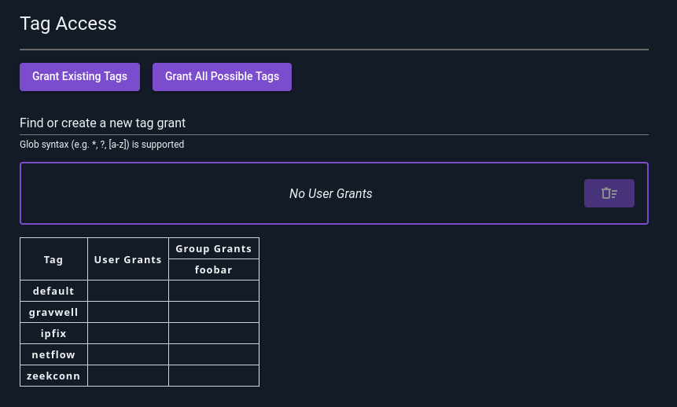
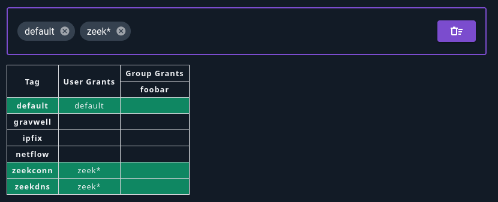
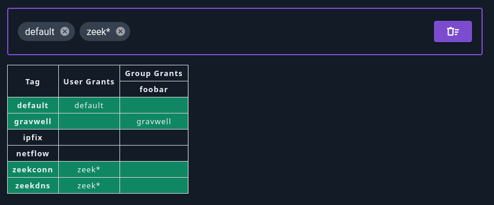
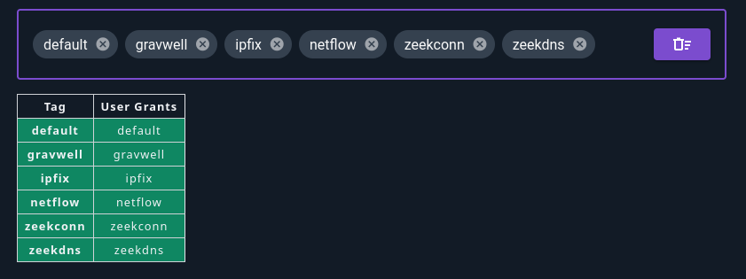
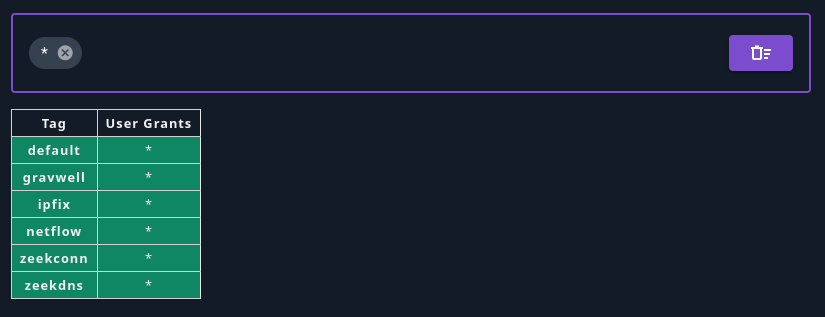

# Capability Based Access Control

Capability Based Access Control (CBAC) is a feature access system that enables users and groups to be configured with fine-grained access to various Gravwell features. For example, using CBAC, a user can be configured to have access to search, but not resources or kits. Additionally, CBAC can be used to define which tags are available to users and groups.

CBAC is based around a deny-all default policy. Capabilities and tag access must be granted to each user (or group a user belongs to) in order to access those features. Admin users are not restricted by CBAC and always have full system access.

## Enabling CBAC

CBAC is enabled by adding the following clause to the global section of the webserver's `gravwell.conf` and restarting the webserver:

```
Enable-CBAC=true
```

Because CBAC has a deny-all default policy, if this is the first time enabling CBAC, _all_ non-admin users will begin with no capabilities or tag access. 

## Capability Access

### Granting Capabilities to Users and Groups

Admin users can grant capability and tag access to both users and groups via the Users and Groups view under Administrator->Users and Administrator->Groups.


When creating or editing a user or group, select the "Capabilities" tab and select the capabilities you wish to add. Users that are part of a group will also inherit capabilities from that group. Note how, in the screenshot above, the user has been added to the "foobar" group and is therefore inheriting the Dashboard capabilities assigned to that group.

Tag access is configured by selecting the Tags tab, and selecting the tags the user or group has access to.

Users that don't have access to a particular feature will see a menu system with those features disabled. For example, a user that does not have access to dashboard or data ingest will see a menu system like this:


### Granting Capabilities in Practice

In practice, it is less common to grant capabilities to individual users; instead, administrators create groups with specific roles and assign users to those groups. For example, creating a group named "IT Users" that has access to IT-related tags (syslog, router logs, firewall logs, etc.), and a group named "Incident Response Users" that has access to IDS and other security related data, allows the admin to grant access to users based on their role. Users that need access to both IT and Incident response data in this example can simply be added to both groups.

### List of CBAC Capabilities

| Capability Name | Description |
|--------|-------|
| Search | Search data and execute queries. |
| Download | Download search results. |
| SaveSearch | Save a search and add notes. |
| AttachSearch | Load a search by search ID. |
| BackgroundSearch | Execute a search in the background. |
| SetSearchGroup | Assign a default group to searches. |
| SearchHistory | View search history of authenticated user |
| SearchAllHistory | View search history of items user has access to. |
| SearchGroupHistory | View a group search history |
| DashboardRead | View and launch dashboard |
| SearchHistory | View search history of the authenticated user. |
| SearchAllHistory | View search history of items the user has access to. |
| SearchGroupHistory | View group search history. |
| DashboardRead | View and launch a dashboard. |
| DashboardWrite | Create and edit a dashboard's searches and settings. |
| ResourceRead | View a resource and use it in a query. |
| ResourceWrite | Create and edit a resource. |
| TemplateRead | View and execute a template. |
| TemplateWrite | Create and edit a template. |
| PivotRead | View and click on an actionable. |
| PivotWrite | Create and edit an actionable. |
| MacroRead | View and use a macro in a query. |
| MacroRead | View a macro and use it in a query. |
| MacroWrite | Create and edit a macro. |
| LibraryRead | View and execute a saved query. |
| LibraryWrite | Create and edit a saved query. |
| ExtractorRead | View and use an extractor in a query. |
| ExtractorRead | View an extractor and use it in a query. |
| ExtractorWrite | Create and edit an extractor. |
| UserFileRead | View a file. |
| UserFileWrite | Create and edit a file. |
| KitRead | View a kit and its contents. |
| KitWrite | Create and edit a kit. |
| KitBuild | Build a kit. |
| KitDownload | Download a kit. |
| ScheduleRead | View a flow, script or scheduled search and its results. |
| ScheduleWrite | Create and edit a flow, script or scheduled search. |
| ScheduleRead | View a flow, script, or scheduled search and its results. |
| ScheduleWrite | Create and edit a flow, script, or scheduled search. |
| SOARLibs | Import an external library into a script. |
| SOAREmail | Send an email in a script or a flow. |
| PlaybookRead | View a playbook. |
| PlaybookWrite | Create and edit a playbook. |
| LicenseRead | View the license. |
| Stats | View health statistics. |
| Ingest | Ingest data. |
| ListUsers | View the list of users. |
| ListGroups | View the list of groups. |
| ListGroupMembers | View the members of a group. |
| NotificationRead | View notifications. |
| NotificationWrite | Create and edit notifications. |
| SystemInfoRead | View systems. |
| SystemInfoRead | View systems info. |
| TokenRead | View API tokens. |
| TokenWrite | Create and edit an API token. |
| SecretRead | User can read and access secrets. |
| SecretWrite | User can create, update, and delete secrets. |
| SecretRead | Read and access secrets. |
| SecretWrite | Create, update, and delete secrets. |

### Determining a CBAC Grant

A user is granted access based on the combination of capabilities and tags that are granted directly to the user and also those granted to any groups the user belongs to.

For example, user "Bob" has access to Search and Resources (but nothing else), and the "gravwell" tag. Bob is also a member of a group that grants access to "Dashboards" and the "default" tag. As a result, "Bob" has access to Search, Resources, and Dashboards, and both the "gravwell" and "default" tags.

### CBAC Restrictions in Search

CBAC capabilities also apply to search. A user that does not have access to resources will still be able to invoke the `lookup` module (and other resource-based modules), but that module will list no resources as being available. Similarly, macros, auto extractors, and related features in the `anko` and legacy `eval` modules will be restricted based on the user's CBAC grants.

### Caveats 

- Some capabilities require both read and write grants in order to function correctly, such as Resources and Playbooks.
- The GUI automatically selects read access for a given feature if any of the write capabilities for that feature are selected. If write-only access is needed, you must use the Gravwell command line tool to configure the capability.
- When CBAC is enabled, the `Webserver-Ingest-Groups` configuration parameter is ignored.

## Tag Access

When CBAC is enabled, regular users do not have access to *any* tags by default. Access to tags is granted to users and groups in a similar manner to capabilities. By default, new users do not have access to any tags:



You can add access to individual tags by typing the tag name in the "Find or create new tag grant" bar and hitting enter. In the following screenshot, we have already created a grant for the "default" tag and are prepared to create a new one for "gravwell":


### Tag Globbing

You can also use [glob wildcards](https://tldp.org/LDP/GNU-Linux-Tools-Summary/html/x11655.htm) to specify multiple tags. For instance, `zeek*` matches all tags beginning with `zeek`. Note that even if you don't have any tags which match the glob *yet*, you can still add the pattern now and the user will get access to matching tags as they are created.



### Group Grants

As with capabilities, users will inherit tag grants from their groups:



Tag grants for groups are set in the exact same way as user grants.

### Tag Grant Shortcuts

There are two shortcut buttons at the top of the Tag Access section in the user editor page: **Grant Existing Tags**, and **Grant All Possible Tags**.


Selecting "Grant Existing Tags" will add individual grants for each tag which currently exists on the system, as shown below. This means that the user will *not* have access to new tags unless you go in and click the button again!



Selecting "Grant All Possible Tags" adds a wildcard grant `*`, which matches all possible tags (see screenshot below). Note that this user will be able to access all tags created in the future.


