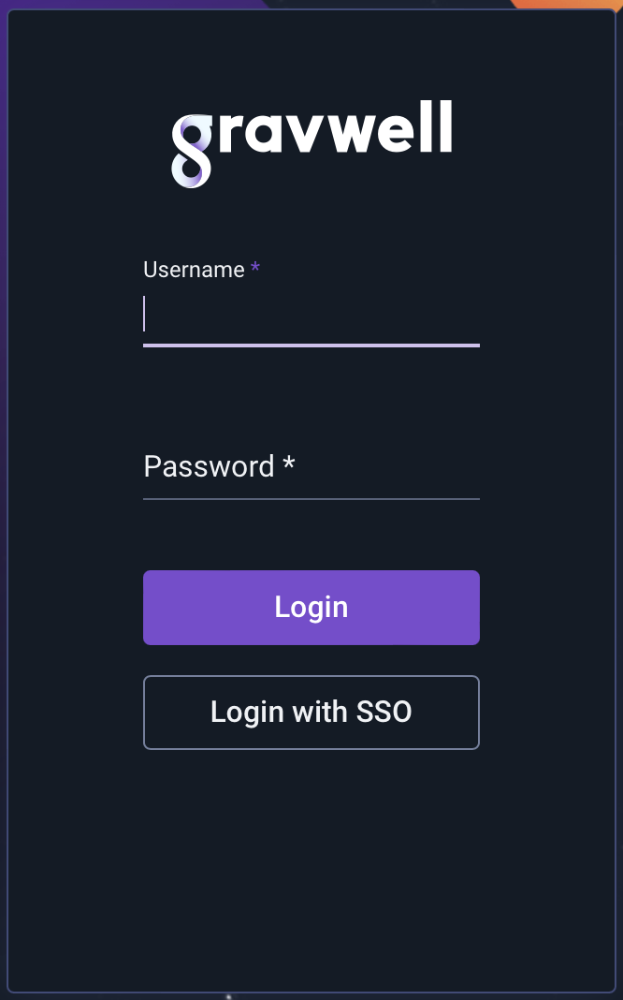

# Configuring SSO for Azure Active Directory

Microsoft's Azure Active Directory service provides cloud-based authentication and single-sign on. Gravwell can integrate with Azure AD for authentication; in fact, it is one of the easiest SSO services to set up!

To set up Azure AD SSO for Gravwell, you'll need the following:

* An Azure Premium License or equivalent which allows the creation of Enterprise Applications & SSO (Contact Microsoft sales to determine your needs).
* A Gravwell webserver configured with [TLS certificates and HTTPS](/configuration/certificates).

Additional Gravwell SSO configuration information can be found [here](/configuration/sso) if needed.

Note: For the purposes of this document, we'll assume your Gravwell webserver's URL is `https://gravwell.example.com/`.

## Create Application in Azure

We manage authentication for Gravwell by creating an "Enterprise Application" in Azure. Within the Azure Active Directory console, select "Enterprise Applications", then select the "New Application" button:


A new screen will open showing options for creating a new application. Select "Create your own application" in the upper left, then fill in the form which comes up:


After clicking "Create", you should be taken to a management page for the newly-created application:


First, select "Assign users and groups" and pick which users or groups should be allowed to log in to Gravwell; you may wish to make a "Gravwell Users" group to keep things simple:


Next, select "Single sign-on" in the left-hand menu and pick SAML in the resulting screen:


You'll be taken to the SAML configuration screen:


 Click the pencil icon on the "Basic SAML Configuration" card. You'll need to fill in the "Identifier" and "Reply URL" fields. "Identifier" should be the URL of your Gravwell server's metadata file, e.g. `https://gravwell.example.com/saml/metadata`. "Reply URL" will be Gravwell's SSO reply URL, e.g. `https://gravwell.example.com/saml/acs`:


Save the basic configuration. Back on the main SAML configuration screen, find the field named "App Federation Metadata URL" and copy the URL contained there; it should look something like `https://login.microsoftonline.com/e802844f-e935-49c1-ba4e-b42442356fe1/federationmetadata/2007-06/federationmetadata.xml?appid=1d41efd8-5cf3-4ac3-9ad3-e3874f48cadc` but the UUIDs in the URL will be different.

## Configure Gravwell

Open `gravwell.conf` on your webserver and create an SSO section:

```
[SSO]
	Gravwell-Server-URL=https://gravwell.example.org
	Provider-Metadata-URL=https://login.microsoftonline.com/e802844f-e935-49c1-ba4e-b42442356fe1/federationmetadata/2007-06/federationmetadata.xml?appid=1d41efd8-5cf3-4ac3-9ad3-e3874f48cadc
	Common-Name-Attribute=http://schemas.microsoft.com/identity/claims/displayname
	Username-Attribute=http://schemas.xmlsoap.org/ws/2005/05/identity/claims/name
```

Change `Gravwell-Server-URL` to point to your Gravwell webserver (this can be an IP address if necessary), then set `Provider-Metadata-URL` to the "App Federation Metadata URL" you copied in the previous section. The other two parameters can be left alone.

Attention: You MUST set the `Provider-Metadata-URL` option; the one given is invalid and serves only as an example.

Now restart the Gravwell webserver (`systemctl restart gravwell_webserver.service`). It should come back up; if not, check for typos in your configuration and look in `/dev/shm/gravwell_webserver.service` and `/opt/gravwell/log/web/` for errors.

## Test SSO

With Gravwell restarted, you should now see a "Login with SSO" button on the login page:



Click it; you should be taken to a Microsoft login page:


Log in as one of the users you set up to access the Gravwell application. Once login is complete, you should be redirected to the Gravwell webserver, logged in as a user with the same username as the Azure user.

## Notes on Groups

Gravwell can automatically create groups and add SSO users to these groups as [documented on the main SSO page](/configuration/sso). You can configure Azure AD to send a claim with groups by clicking 'Add a group claim' in the application's User Attributes & Claims configuration page:


To enable groups, you'll need to tell Gravwell which attribute contains the list of groups and specify the mapping from Azure group IDs (which are sent as UUIDs) to the desired group name in Gravwell. If you have a group with Azure Object ID = dc4b4166-21d7-11ea-a65f-cfd3443399ee that you want to be named "gravwell-users", you should add this to your gravwell.conf's SSO section:

```
	Groups-Attribute=http://schemas.microsoft.com/ws/2008/06/identity/claims/groups
	Group-Mapping=dc4b4166-21d7-11ea-a65f-cfd3443399ee:gravwell-users
```
