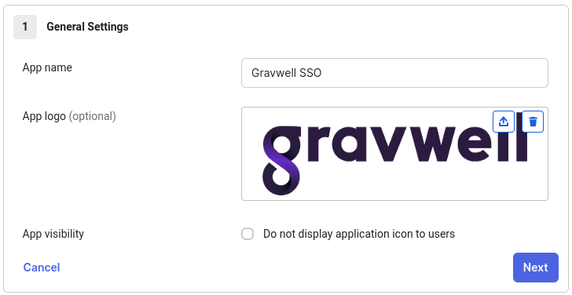
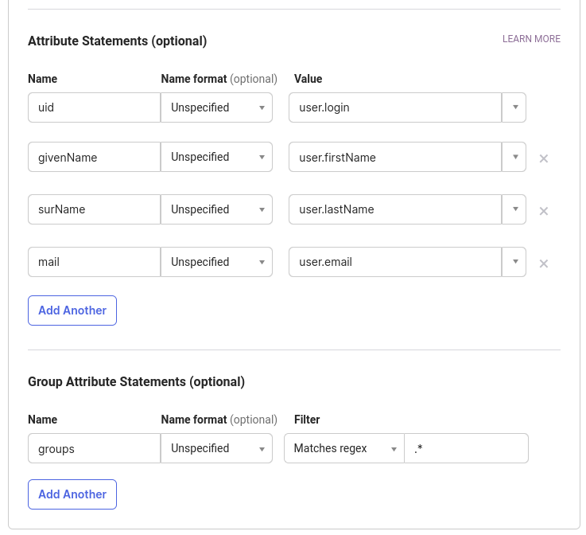
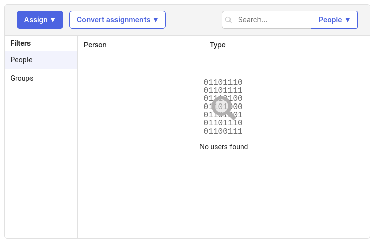

# Configuring OKTA SSO with Gravwell

OKTA is a managed identity provider that provides cloud hosted identity and authentication services; if your organization uses OKTA for identity management, integrating with Gravwell is an incredibly easy process.

In this document, we assume the following:

* The Gravwell instance has a valid DNS name of gravwell.example.com.
* The Gravwell instance is publically available with valid SSL certificates.
* You are an Okta admin and can establish a new application and assign users to it.


## Creating The Okta Application

The first step is to log into the Okta management console and click on `Applications`, then click `Create App Integration` to begin setting up a Gravwell integration.


Name your application and upload an image so that users know what they are interacting with; feel free to grab our logo and use it.



Make sure to set the appropriate fully qualified URL for your SSO URL and SP Entity ID URL; given the domain of `gravwell.example.com` the appropriate URLs are `https://gravwell.example.com/saml/acs` and `https://gravwell.example.com/saml/metadata`.


Next configure Attribute Statements so that user information such as names, emails, and groups can be transmitted from Okta to Gravwell during account creation.  The `uid` and `mail` attributes are manditory, but we suggest adding `givenName` and `surName` too.  Also add the Group Attribute Statements to describe which groups will be sent from Okta to Gravwell; you can filter which groups are sent using a prefix, postfix, or even a regular expression.  For this example we are sending all groups.



If you wish to double check the configuration XML click `Preview the SAML Assertion`, it may look something like this:

```
<?xml version="1.0" encoding="UTF-8"?>
<saml2:Assertion ID="id12345678901234567890" IssueInstant="2023-08-08T22:22:08.424Z" Version="2.0"
    xmlns:saml2="urn:oasis:names:tc:SAML:2.0:assertion">
    <saml2:Issuer Format="urn:oasis:names:tc:SAML:2.0:nameid-format:entity">http://www.okta.com/exk6ukjm9vpaGcPe8697</saml2:Issuer>
    <saml2:Subject>
        <saml2:NameID Format="urn:oasis:names:tc:SAML:2.0:nameid-format:transient">kris.watts@gravwell.io</saml2:NameID>
        <saml2:SubjectConfirmation Method="urn:oasis:names:tc:SAML:2.0:cm:bearer">
            <saml2:SubjectConfirmationData NotOnOrAfter="2023-08-08T22:27:08.424Z" Recipient="https://gravwell.example.com/saml/acs"/>
        </saml2:SubjectConfirmation>
    </saml2:Subject>
    <saml2:Conditions NotBefore="2023-08-08T22:17:08.424Z" NotOnOrAfter="2023-08-08T22:27:08.424Z">
        <saml2:AudienceRestriction>
            <saml2:Audience>https://gravwell.example.com/saml/metadata</saml2:Audience>
        </saml2:AudienceRestriction>
    </saml2:Conditions>
    <saml2:AuthnStatement AuthnInstant="2023-08-08T21:38:53.551Z" SessionIndex="id12345678.123456789">
        <saml2:AuthnContext>
            <saml2:AuthnContextClassRef>urn:oasis:names:tc:SAML:2.0:ac:classes:PasswordProtectedTransport</saml2:AuthnContextClassRef>
        </saml2:AuthnContext>
    </saml2:AuthnStatement>
    <saml2:AttributeStatement>
        <saml2:Attribute Name="uid" NameFormat="urn:oasis:names:tc:SAML:2.0:attrname-format:unspecified">
            <saml2:AttributeValue
                xmlns:xs="http://www.w3.org/2001/XMLSchema"
                xmlns:xsi="http://www.w3.org/2001/XMLSchema-instance" xsi:type="xs:string">user.dude@example.com
            </saml2:AttributeValue>
        </saml2:Attribute>
        <saml2:Attribute Name="givenName" NameFormat="urn:oasis:names:tc:SAML:2.0:attrname-format:unspecified">
            <saml2:AttributeValue
                xmlns:xs="http://www.w3.org/2001/XMLSchema"
                xmlns:xsi="http://www.w3.org/2001/XMLSchema-instance" xsi:type="xs:string">User
            </saml2:AttributeValue>
        </saml2:Attribute>
        <saml2:Attribute Name="surName" NameFormat="urn:oasis:names:tc:SAML:2.0:attrname-format:unspecified">
            <saml2:AttributeValue
                xmlns:xs="http://www.w3.org/2001/XMLSchema"
                xmlns:xsi="http://www.w3.org/2001/XMLSchema-instance" xsi:type="xs:string">Dude
            </saml2:AttributeValue>
        </saml2:Attribute>
        <saml2:Attribute Name="mail" NameFormat="urn:oasis:names:tc:SAML:2.0:attrname-format:unspecified">
            <saml2:AttributeValue
                xmlns:xs="http://www.w3.org/2001/XMLSchema"
                xmlns:xsi="http://www.w3.org/2001/XMLSchema-instance" xsi:type="xs:string">user.dude@example.com
            </saml2:AttributeValue>
        </saml2:Attribute>
        <saml2:Attribute Name="groups" NameFormat="urn:oasis:names:tc:SAML:2.0:attrname-format:unspecified">
            <saml2:AttributeValue
                xmlns:xs="http://www.w3.org/2001/XMLSchema"
                xmlns:xsi="http://www.w3.org/2001/XMLSchema-instance" xsi:type="xs:string">group1
            </saml2:AttributeValue>
            <saml2:AttributeValue
                xmlns:xs="http://www.w3.org/2001/XMLSchema"
                xmlns:xsi="http://www.w3.org/2001/XMLSchema-instance" xsi:type="xs:string">group2
            </saml2:AttributeValue>
        </saml2:Attribute>
    </saml2:AttributeStatement>
</saml2:Assertion>
```

After finalizing your application integration, Okta will show a `Sign On Methods` screen containing a SAML 2.0 Metadata URL. Copy the URL (you will need it for your `gravwell.conf` configuration).

Next go to your Okta application and assign people and groups to the application; the group assignments can control which groups are passed to Gravwell as well as which users can log into the application.



## Set up Gravwell configuration block

On the system running the Gravwell webserver, create a file named `/opt/gravwell/etc/gravwell.conf.d/sso.conf` and paste the following into it:

```
[SSO]
    Gravwell-Server-URL="https://gravwell.example.com"
    Provider-Metadata-URL="https://trial-niner-niner.okta.com/app/abcdefghijklmnop/sso/saml/metadata"
    Username-Attribute=uid
    Given-Name-Attribute=givenName
    Surname-Attribute=surName
    Email-Attribute=mail
    Groups-Attribute=groups
	Group-Mapping=group1:groupOne
	Group-Mapping=group2:groupTwo
```

```{note}
Do not forget to adjust the Gravwell-Server-URL and Provider-Metadata-URL.
```

### Gravwell configuration block details
The `Gravwell-Server-URL` parameter should contain the URL used to access your Gravwell server.

The `Provider-Metadata-URL` parameter points at the Okta provided metadata URL; this will be unique for each app integration.

Note the `Group-Mapping=group1:groupOne` option. This tells Gravwell that users in the Okta group named "group1" should be placed into a Gravwell internal group named "groupOne". You can repeat the `Group-Mapping` parameter multiple times to include multiple groups.

The remaining config options tell Gravwell how to map attributes in the SSO request to Gravwell user accounts. These do not need to be modified, but they should match the values you specify in the Okta setup page.

Once you've saved the configuration file, you can restart the Gravwell webserver.

## Restart Gravwell and test login

You should now restart the Gravwell webserver:

```
systemctl restart gravwell_webserver
```

Then go to your Gravwell login screen; you should see the "Login with SSO" button underneath the regular username & password fields. Clicking this button will take you to the Okta login page, where you can enter credentials for a valid Okta user. This should log you in to Gravwell.
