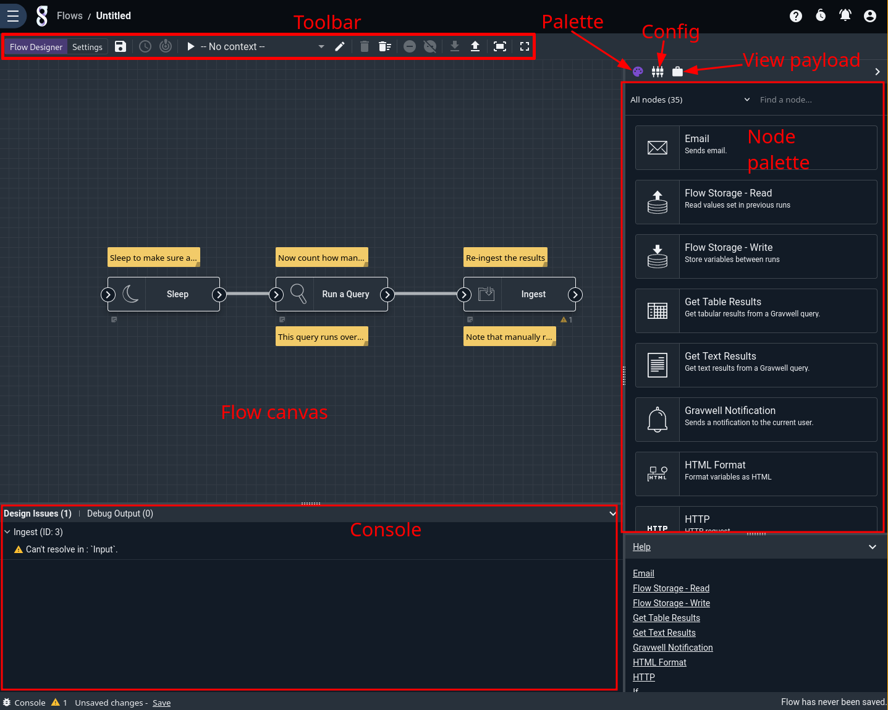
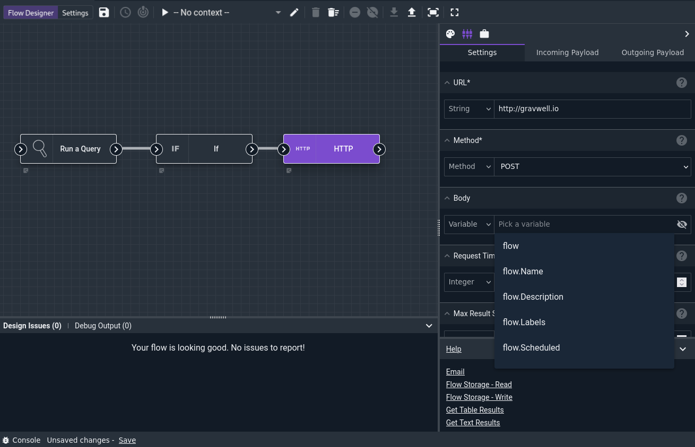
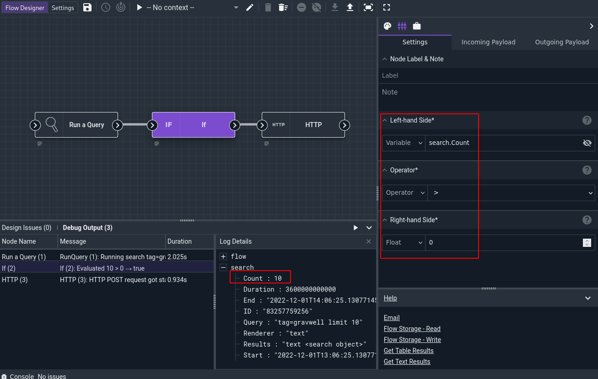
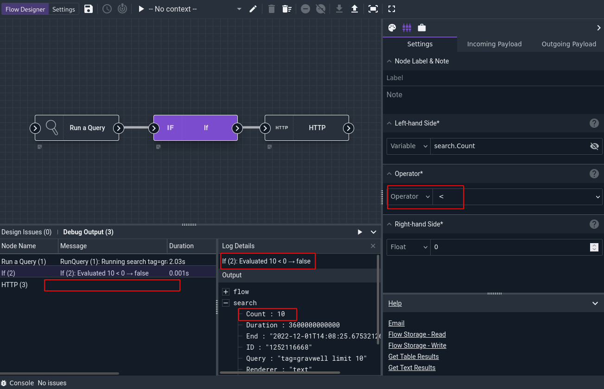
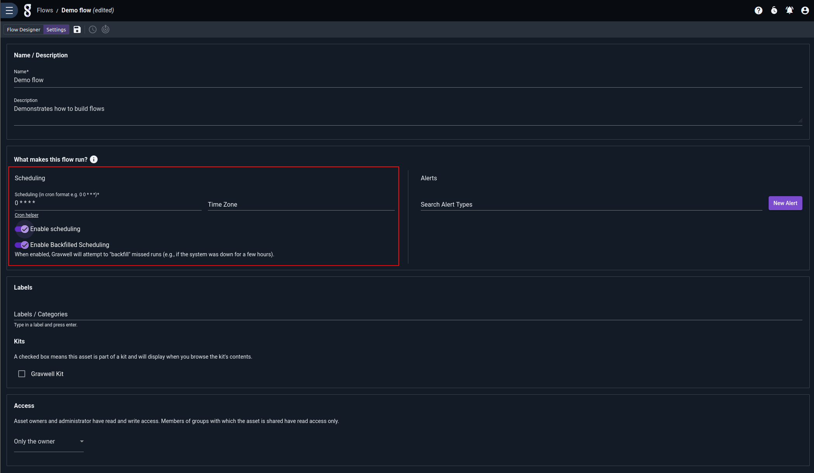
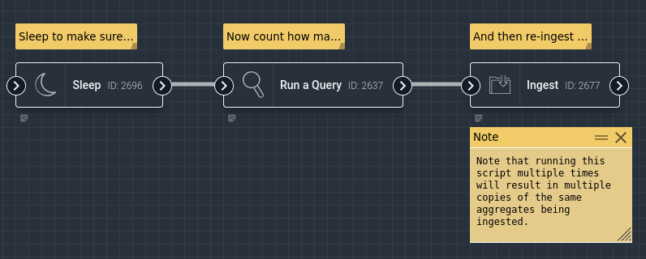

# The Flow Editor

Although the Gravwell flow editor can be intimidating at first glance, a few minutes' worth of experimentation and exploration should be enough to get started building flows. This section will go through the various components of the UI, explaining each component.

```{note}
If you're not yet familiar with the basic components of a flow (nodes, sockets, payloads), refer to the [top-level Flow documentation](flows) for an overview.
```

You can access the flow editor from the Query Studio interface, found in the Main Menu. Select "Flows" from the left-hand side, as shown in the screenshot below. From there, you can either start a new blank flow ("Start a New Flow") or instantiate one of the "starter flows" provided by Gravwell.


Selecting either option will take you into the flow editor, the parts of which are marked in the screenshot below. The **palette** provides a list of available nodes, which can be dragged out into the **canvas**. The **console** provides information about problems with the flow and output from any test runs.



Nodes are instantiated by dragging them from the palette onto the canvas. Once on the canvas, node input and output sockets can be connected, nodes can be re-arranged, etc. Note that the scroll wheel can be used to zoom in and out of the canvas view.

The toolbar contains buttons for quick access to editor functionality. From left to right:

* Flow Designer: shows the flow canvas (default view).
* Info & Scheduling: shows options to set flow name, description, scheduling, sharing, etc.
* Enable scheduling: toggle to quickly enable/disable automatic execution of the flow.
* Save: save the flow.
* Debug: run the flow
* Clear selection: deselects any currently-selected node.
* Delete: delete the selected node.
* Delete all: delete all nodes (requires confirmation).
* Export flow: download the flow specification, for backup or sharing.
* Import flow: upload a previously-exported flow spec.
* Fit all nodes on screen: zoom & center the canvas so that *all* nodes are visible.
* Fullscreen: puts the editor into fullscreen mode.

## Configuring Nodes

Once a node has been instantiated by dragging it from the palette to the canvas, it must be configured. Clicking on the node will bring up the configuration pane:



The HTTP node shown here is a particularly complex node with many config options, which serves well for demonstration. Note that the URL and Method fields are marked with an asterisk, indicating that they are required. Note also the drop-down menus for each config option; these allow you to change between entering a constant value (e.g. the string "http://gravwell.io" in the URL config) or selecting a value from the payload as shown with the Body config.


If a node is misconfigured, the console will display a list of problems. In the screenshot above, we can see that the Email node has several config options which are not yet set. As those options are populated, the errors will go away.

```{note}
You can return to the palette view by clicking the palette icon above the configuration pane.
```

## Debugging

Once a flow has been designed and configured, it can be debugged. This will signal the search agent component that it should try executing the flow. To start a debug run, click the "Run flow and debug" button in the toolbar:


The user interface will then wait for the search agent to complete its run:


Once the run is complete, the console will have detailed execution information for each node in the "Debug Output" pane. The nodes are listed in order of execution. Clicking on a node in the debug output will bring up a pane showing that node's log output and the actual contents of that node's output payload. In the screenshot below, we can see that the If node received a payload where search.Count was "10", meaning the If node's boolean statement evaluated to true and the HTTP node was allowed to execute:



If we modify the If node's config so the statement is `search.Count < 1` and re-run the flow, we'll see that it now evaluates to false and the HTTP node does not execute (as seen by the empty "Message" column in the Debug Output pane):



## Info & Scheduling

Once you're happy with a flow, the final step is to give it a schedule and enable it. This is done in the "Info & Scheduling" page, accessible via a button in the toolbar:


You should specify a name and description for the flow, then define a schedule. The schedule is set in [cron format](https://cron.help/), which is very flexible but can also be intimidating. There are a few shortcuts for simple cases: `@hourly` runs at the start of every hour, `@daily` at midnight every day, and so on.



Once the schedule is set, toggle the "Enable scheduling" option to enable scheduled executions of the flow. The search agent will then automatically run it on the given schedule.

The "Enable Backfilled Scheduling" toggle controls whether or not Gravwell will attempt to "backfill" flow executions which *should* have happened but were skipped because e.g. the Gravwell webserver was temporarily offline. If enabled, Gravwell will look at the last execution time of the flow and the schedule string, then figure out every time it should have run between the last execution and now. It will then re-run the flow for each instance, setting the `flow.Scheduled` field appropriately. The `flow.Scheduled` timestamp is used as the endpoint for Run Query nodes in the flow, so backfilled flows which run queries will run the queries over the appropriate time span.

We recommend leaving backfilling on in most cases.

## In-Flow "Sticky" Notes

The "Note" node is a special node used to annotate flows. Unlike other nodes, it plays no role in the execution of the flow; notes exist purely for the convenience of users.

When dragged from the palette, a Note node starts out in a minimized state:


When clicked, the note expands and text can be entered:


Clicking the "X" will minimize the note, leaving the start of the text visible:



