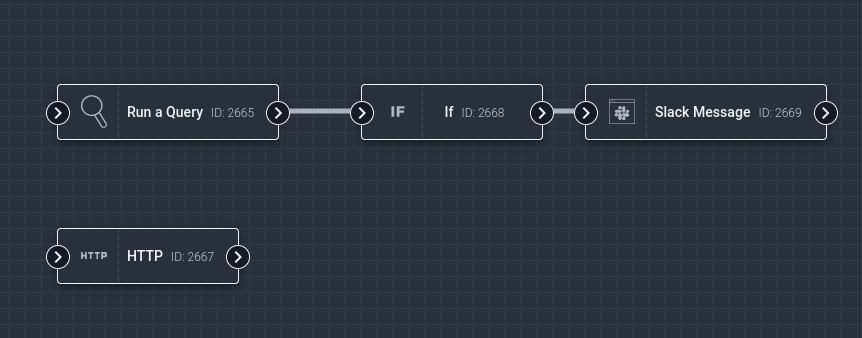

# Flows

Flows provide a no-code method for developing advanced automations in Gravwell. By wiring together nodes in a drag-and-drop user interface, you can:

* Run queries
* Generate PDF reports
* Send emails
* Fire off Slack and MS Teams messages
* Re-ingest alerts
* and more!

This document will describe what makes a flow, the flow editor, and how to debug & deploy your own flows.

## Basic flow concepts

Flows are *automations*, meaning they are normally executed on a user-specified schedule by the search agent. You can also run them manually through the user interface. The basic process of flow development is:

1. Create a new flow
2. Instantiate nodes in the flow and connect them together
3. Configure nodes
4. Test the flow with debug runs
5. Deploy the flow by setting a schedule & enabling scheduled execution

### Nodes

A flow is a collection of *nodes*, linked together to define an order of execution. Each node does a single task, such as running a query or sending an email. In the example below, the leftmost node runs a Gravwell query, then the middle node formats the results of that query into a PDF document, and finally the rightmost node sends that PDF document as an email attachment.

All nodes have a single output socket. Most have only a single input socket, but some nodes which merge *payloads* (see below) have multiple input sockets.

### Payloads

*Payloads* are collections of data passed from node to node, representing the state of execution. For instance, the "Run a Query" node will insert an item named "search" into the payload, containing things like the query results and metadata about the search. The PDF node can *read* that "search" item, format it into a nice PDF document, and insert the PDF file back into the payload with a name like "gravwell.pdf". Then the Email node can be configured to attach "gravwell.pdf" to the outgoing email.

The node receives an incoming payload through its *input* socket, then passes its outgoing payload via the *output* socket. In most cases, the outgoing payload will be a modified version of the incoming payload.

### Execution order

Nodes are always executed one at a time. A node can be executed if all nodes upstream of it (its *dependencies*) have executed. If multiple nodes are ready to execute, one will be chosen at random. In the example below, both the "Run a Query" node and the "HTTP" node are candidates to run first. After the Query node finishes, the If node can execute; when it is done, the Slack Message node may run. We say that the If node is *downstream* of the Query node, and the Slack node is *downstream* of both the If and Query nodes.

Note that some nodes may block execution of downstream nodes. The **If** node is configured with a boolean logic expression; if that expression evaluates to *false*, none of the If node's downstream nodes are executed. Nodes which can block downstream execution will always have a note to that effect in the online documentation.

## Flow editor

Flows are created using the flow editor. Please refer to the [flow editor documentation](editor.md) for a detailed description of the editor, instructions on how to use it, and information about debugging & scheduling flows.

## Node list

* [Email](nodes/email.md): send email.
* [Gravwell Indexers](nodes/indexerinfo.md): get information about Gravwell indexers.
* [Gravwell Ingesters](nodes/ingesterinfo.md): get information about Gravwell ingesters.
* [HTTP](nodes/http.md): do HTTP requests.
* [If](nodes/if.md): perform logical operations.
* [Ingest](nodes/ingest.md): ingest data into Gravwell.
* [Run a Query](nodes/runquery.md): run a Gravwell query.

The following nodes tend to be needed only in particular advanced cases:

* [Get Table Results](nodes/gettableresults.md): get results from a search using the table renderer.
* [Get Text Results](nodes/gettextresults.md): get results from a search using the text renderer.