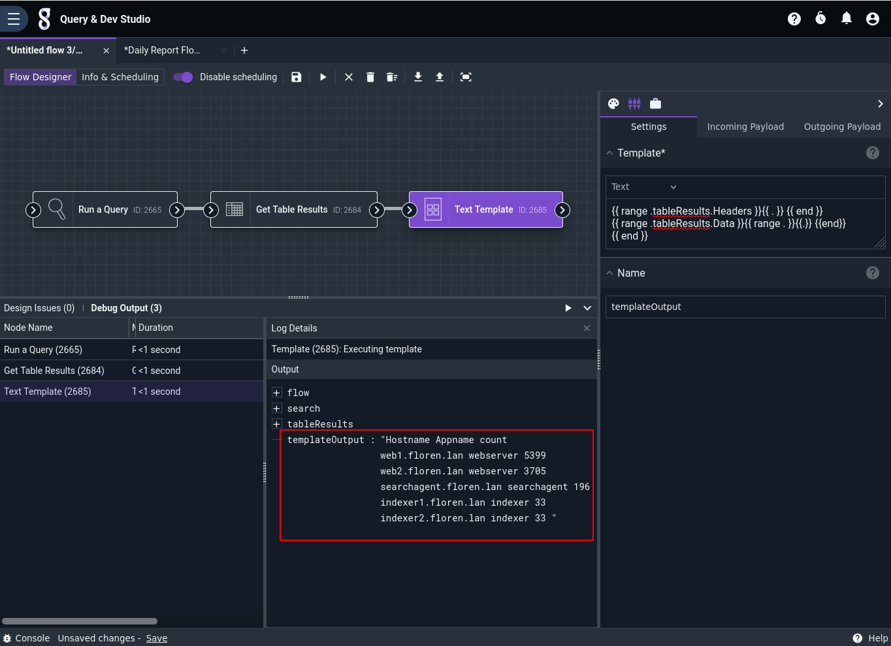
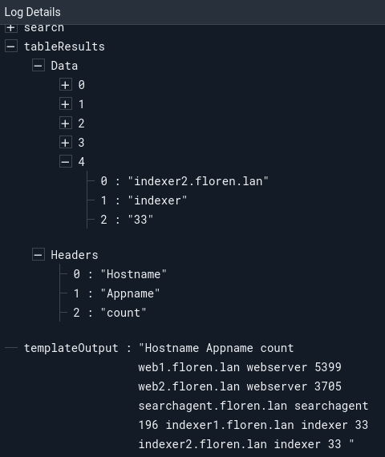

# Get Table Results Node

This node fetches a user-specified number of results from a search which was previously executed using the [Run a Query](runquery) node. Many nodes, such as the [PDF](pdf) node, can operate directly on the search object output by the Query node, but in situations where user-accessible results are needed (such as the [Text Template](template) node), this node can provide them.

## Configuration

* `Search`, required: The search from which results should be fetched. This should be the output of a [Run a Query](runquery) node.
* `Count`, required: The number of rows to fetch from the results. This can be a static integer, or it can be set to `search.Count` to fetch all results from the query.
* `Output Variable Name`: Results will be stored in the payload under this name. Defaults to `tableResults`.

## Output

The node inserts an object into the payload, using the key set in the `Output Variable Name` config option. This object contains an array of strings named `Headers`, which gives the names of the table columns. It also contains a field named `Data`, which is an array of arrays containing the rows of the table. The following is an example of the object, rendered in a JSON representation:

		"Headers": [
			"Hostname",
			"Appname",
			"count"
		],
		"Data": [
			[
				"web1.floren.lan",
				"webserver",
				"5158"
			],
			[
				"web2.floren.lan",
				"webserver",
				"3596"
			]
		]

## Example

This example uses the Get Table Results and Text Template nodes to generate a very simplistic table representation of query results. Note that this is rarely needed, as many output nodes can generate an acceptable formatting of queries on their own.

The Query node is configured to run the following query over the last hour:

	tag=gravwell syslog Hostname Appname | stats count by Hostname Appname | table

The Get Table Results node is configured to read 10 results from that search.

The Text Template node is configured with the following template:

```
{{ range .tableResults.Headers }}{{ . }} {{ end }}
{{ range .tableResults.Data }}{{ range . }}{{.}} {{end}}
{{ end }}
```

In the screenshot below, we can see that the Text Template node has produced a decent text representation of the table:



If we expand the `tableResults` item in the payload view, we can see the raw data as it came out of the Get Table Results node:


