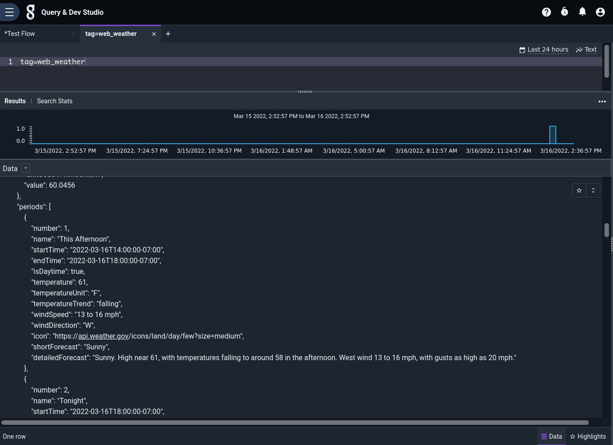

# Ingest Node

This node ingests data into Gravwell under a specified tag. Note that the user must be a member of a group specified in the [`Webserver-Ingest-Groups` configuration parameter](/configuration/parameters) to ingest entries.

## Configuration

* `Tag`, required: the Gravwell tag into which the data should be ingested.
* `Input`, required: the data to ingest.
* `Split Lines`: if set to true, the node will split the input data into separate entries at newline boundaries.

## Output

The node does not inject anything into the payload, but it does ingest entries into Gravwell.

## Example

This example fetches JSON weather information from `api.weather.gov` and ingests it into the `web_weather` tag.

The HTTP node is configured to perform a GET request on `https://api.weather.gov/gridpoints/MTR/82,105/forecast` to fetch a weather report from the San Francisco peninsula. The ingest node then takes the `response` value (generated by the HTTP node) and ingests it into the web_weather` tag. Because we wish to ingest the entire HTTP response in a single entry, we leave the Split Lines config option set to "No".

A query run on the `web_weather` tag shows the results:

