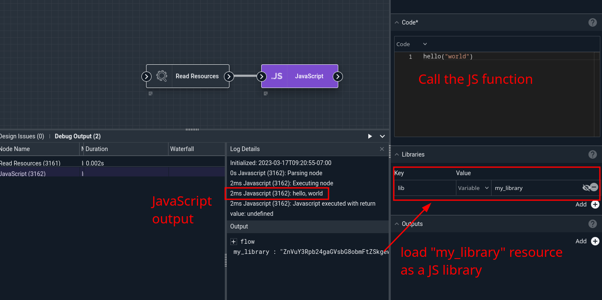
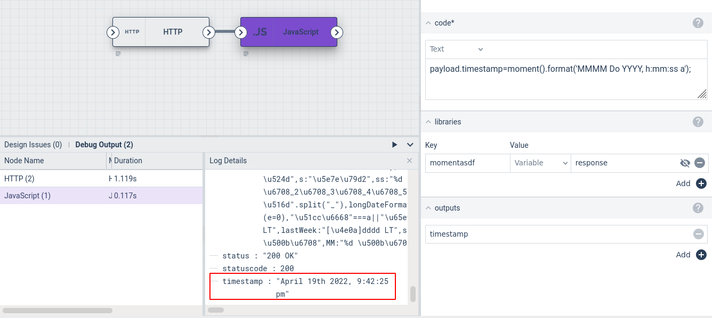

# JavaScript Node

This node can execute JavaScript code in a flow. It can read from the payload and insert values into the outgoing payload. It can also load JavaScript libraries for additional functionality.

## Configuration

* `Code`, required: The JavaScript code to run.
* `Libraries`: Loads optional JavaScript libraries. This is a key-value configuration block in which the key is the name of the library (for organizational purposes only) and the value is the contents of the library.
* `Outputs`: a list of variables to be output from the script (see below).

## Output

The JavaScript node can modify any value in the incoming payload. It can also create new items in the outgoing payload, but those new items *must* be listed in the Outputs config field.

Variables in the payload are accessed in JavaScript code with the prefix `payload`, e.g. `payload.flow.Scheduled` to get the scheduled execution time of the flow.

## Libraries

The Libraries configuration section allows you to load JavaScript libraries. It is a key-value configuration block: the key is the name of the library, and the value is the contents of the library (usually a variable in the payload). Note that the key name is for organizational purposes only and is not used by the JavaScript node itself -- but it can help you, the user, remember that the variable named "response" being loaded as a library actually contains the MomentJS library!


## Examples

### Libraries

This example loads a JS library from a resource and calls a function from the library.

The "library" is a resource named `my_library` containing the following code:

```
function hello(name) {
	console.log("hello, " + name)
}
```

We configure a [Read Resource](resourceget.md) node to read the contents of the resource into the payload:


Then we set up a JavaScript node which loads that library (the "Key" for the library is for your organizational purposes only, we just name it "lib") and calls the function:



### Libraries & Output

This example fetches a JavaScript library from a web server, then uses that library to format a timestamp.

The HTTP node is configured to fetch the MomentJS library from `https://momentjs.com/downloads/moment-with-locales.min.js`. The JavaScript node then uses `response` (the body of the HTTP response, containing the JS library) as input to its `libraries` config option; this will make the JS node load the MomentJS library before executing the user code. We also set up an output named `timestamp`. The code (below) then formats the current time and puts the result into the payload:

```
payload.timestamp=moment().format('MMMM Do YYYY, h:mm:ss a');
```



Note the name of the variable being written: `payload.timestamp`. This sets a variable named "timestamp" inside the "payload" object. When the code is done running, the JavaScript node looks through the list of output variables we specified and attempts to extract each from the payload object; in this case, we only defined one, "timestamp".

The `timestamp` variable may then be used by other nodes, for example the Text Template node.