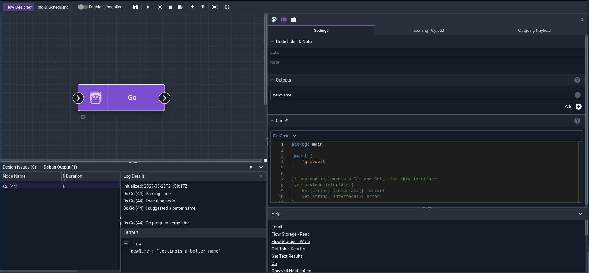
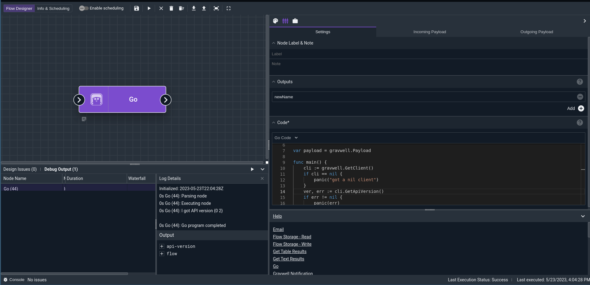
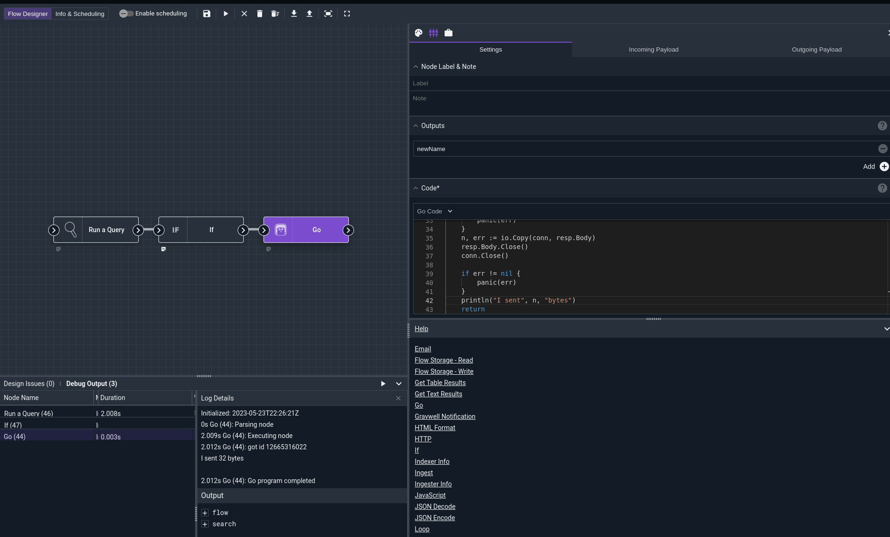

# Go Node

This node can execute a limited subset of Go code in a flow.  The node uses the open source [Scriggo](https://github.com/open2b/scriggo) project to execute Go code using a custom interpretter.

```{note}
The Scriggo Go interpretter does not implement all of the Go specification and may behave unexpectedly when relying on reflection or complex pointer pointer operations.  The Go node is useful for performing simple type-aware operations in a flow, not writing complex automation programs.
```

## Restrictions

The Go flow node has some notable restrictions on what it can and can't do.  The following are some of the restrictions to be aware of.

* No go routines, the `go` keyword is disabled and the node cannot launch go routines.
* No reflection on custom types, the `reflect` package cannot handle types defined in your programs.
* Limited libraries, you can only import libraries that are included in the searchagent, full list at the end of this page.
* No `unsafe` package and limited pointer operations, unsafe package cannot be imported and pointer arithmetic will likely result in unexpected results.

## Configuration

* `Code`, required: The Go code to run.
* `Outputs`: a list of variables to be output from the program (see below).

## Output

The Go node can modify any value in the incoming payload. It can also create new items in the outgoing payload, but those new items *must* be listed in the Outputs config field.

Variables in the payload are accessed in Go code by using the Gettter/Setter interface on the `Payload` variable exported in the `gravwell` package, e.g. `gravwell.Payload.Set("foobar", 3.14159)`.

### Output Debugging

All `stdout` or `stderr` output will be written to the Flow console log; this means including a `println("hello mom!")` will include `hello mom!` in the flow debug output.

## Native Gravwell Package

The Go flow node can import a package called `gravwell` that will allow access to flow specific functions and values.  The `gravwell` package can almost be thought of as a virtual package because it simply maps global variables and some internal flow functionality to a package so that Go node programs can interact with flow variables.

The `gravwell` package exposes the following variables and functions:

### Payload Getter and Setter

One of the most useful variables in the `gravwell` package is the `Payload` variable which enables getting and setting natively typed values into the Flow payload.  The `Payload` varialbe implements the following interface:
```
type Payload interface {
	Get(string) (interface{}, error)
	Set(string, interface{}) error
}
```

The `Payload` interface allows for getting and setting native types into the flow payload similar to the [Javascript](/flows/nodes/javascript) node or other logic nodes.

```{note}
If you define a new struct type in your Go program and set it into the flow Payload may result in undefined behavior because that type information won't make it outside the Go flow node.
```

### Other Package Types

| Name     | Type/Prototype      | Description                                                    |
|----------|---------------------|----------------------------------------------------------------|
| `START`    | [time.Time](https://pkg.go.dev/time#Time) | The scheduled start time for the flow, this time may be in the past if the flow is backfilling missed runs. |
| `LAST_RUN` | [time.Time](https://pkg.go.dev/time#Time) | The timestamp of the last run of this flow. |
| `DURATION` | [time.Duration](https://pkg.go.dev/time#Duration) | The the scheduled time duration of a flow run, this repesents the time window the flow should cover for any queries. |
| `ThisScriptID` | `string` | The current flow ID |
| `GetClient` | `func() *client.Client` | Returns an active logged in client for use, [client.Client](https://pkg.go.dev/github.com/gravwell/gravwell/v3/client#Client) docs available. |
| `SetPersistentMap` | `SetPersistentMap(mapName string, key string, value interface{})` | Set a natively typed value into the persistent map that can be retrieved accross runs. |
| `GetPersistentMap` | `GetPersistentMap(mapName string, key string) (value interface{})` | Get a persistent map value from previous runs. |
| `DeletePersistentMap` | `DeletePersistentMap(mapName, value string)` | Delete a value from the persistent map. |
| `PersistentMap` | `PersistentMap(mapName string) map[string]interface{}` | Get a complete persistent map. |
| `Backup` | `Backup(wtr io.Writer, includeSS bool) (err error)` | Create a new backup with a provided `io.Writer`. |
| `BackupWithConfig` | `BackupWithConfig(wtr io.Writer, cfg types.BackupConfig) (err error)` | Create a new backup with the provided `io.Writer` and [BackupConfig](). |
| `GetMacro` | ` GetMacro(key string) (string, error)` | Retrieve a system macro. |
| `Systems` | `Systems() (map[string]types.SysInfo` | Get a map of [SysInfo](https://pkg.go.dev/github.com/gravwell/gravwell/v3/client/types#SysInfo) structures using the system name as the map key. |
| `Ingesters` | `Ingesters() (map[string]types.IngestStats, error)` | Get a map of [IngesterStats](https://pkg.go.dev/github.com/gravwell/gravwell/v3/client/types#IngesterStats) keyed by terminating indexer UUID. |
| `Indexers` | `Indexers() (map[string]types.IdxStats, error)` | Get a map of [IdxStats](https://pkg.go.dev/github.com/gravwell/gravwell/v3/client/types#IdxStats) keyed by indexer UUID.   This API call is expensive and returns the complete shard state system wide.  |
| `IndexerStates` | `IndexerStates() (map[string]string, error)` | Get a map of indexer health states keyed by indexer UUID.|
| `AddSelfTargetedNotification` | `AddSelfTargetedNotification(id uint32, msg, link string, expires time.Time) error` | Create a Gravwell notification. |
| `GetResource` | `GetResource(key string) ([]byte, error)` | Get a gravwell reasource. |
| `SetResource` | `GetResource(key string, value []byte) (error)` | |
| `ScheduledSearchInfo` | `ScheduledSearchInfo() ([]types.ScheduledSearch, error)` | Get the list of [ScheduledSearch](https://pkg.go.dev/github.com/gravwell/gravwell/v3/client/types#ScheduledSearch) structures for the current user. |
| `GetSecret` | `GetSecret(name string) (string, error)` | Retrieve a secret value, this is the complete secret value, be careful with this call. |

## Examples

Below are a few basic examples of using the Go node to perform some specific operations that may be useful in a Flow.

### Basic Program

This basic program shows how we grab a value from the flow payload, modify it, and put it back.  The basic flow might look like the following:



```{code}
package main

import (
	"gravwell"
)

/* payload implements a Get and Set, like this interface: 
type payload interface {
	Get(string) (interface{}, error)
	Set(string, interface{}) error
}
*/

var payload = gravwell.Payload

func main() {
	if name, err := payload.Get(`flow.Name`); err != nil {
		panic("Failed to get flow.Name")
	} else if err = payload.Set(`newName`, name.(string) + "is a better name"); err != nil {
		panic("failed to set new name")
	}
	println("I suggested a better name")
	return
}
```


### Getting a Client

This basic program shows how to get a handle on a client and then use it to perform some more complicated using the client.



```
package main

import (
	"gravwell"
)

var payload = gravwell.Payload

func main() {
	cli := gravwell.GetClient()
	if cli == nil {
		panic("got a nil client")
	}
	ver, err := cli.GetApiVersion()
	if err != nil {
		panic(err)
	}
	payload.Set("api-version", ver)
	println("I got API version", ver)
	return
}
```

### Getting Search Results

In this flow we grab a search ID and then use a client to download the results and relay them out to a TCP socket.  This example demonstrates using the Go node to attach to a native search type as well as export the data through an imported library funcition.



```
package main

import (
	"gravwell"

	"net"
	"fmt"
	"io"

	"github.com/gravwell/gravwell/v3/client/types"
)

var payload = gravwell.Payload

func main() {
	cli := gravwell.GetClient()
	if cli == nil {
		panic("got a nil client")
	}
	val, err := payload.Get(`search.ID`)
	if err != nil {
		panic(err)
	}
	id := fmt.Sprintf("%v", val)
	println("got id", id)
	conn, err := net.Dial("tcp", "172.17.0.2:8888")
	if err != nil {
		panic(err)
	}
	tr := types.TimeRange{} //blank for all time
	resp, err := cli.SearchDownloadRequest(id, `csv`, tr)
	if err != nil {
		panic(err)
	}
	n, err := io.Copy(conn, resp.Body)
	resp.Body.Close()
	conn.Close()

	if err != nil {
		panic(err)
	}
	println("I sent", n, "bytes")
	return
}
```

## Available Libraries For Import

### Standard Library Packages

* archive/tar
* archive/zip
* bufio
* bytes
* compress/bzip2
* compress/flate
* compress/gzip
* compress/lzw
* compress/zlib
* container/heap
* container/list
* container/ring
* context
* crypto
* crypto/aes
* crypto/cipher
* crypto/des
* crypto/dsa
* crypto/ecdsa
* crypto/elliptic
* crypto/hmac
* crypto/md5
* crypto/rand
* crypto/rc4
* crypto/rsa
* crypto/sha1
* crypto/sha256
* crypto/sha512
* crypto/subtle
* crypto/tls
* crypto/x509
* crypto/x509/pkix
* debug/dwarf
* debug/elf
* debug/gosym
* debug/macho
* debug/pe
* debug/plan9obj
* encoding
* encoding/ascii85
* encoding/asn1
* encoding/base32
* encoding/base64
* encoding/binary
* encoding/csv
* encoding/gob
* encoding/hex
* encoding/json
* encoding/pem
* encoding/xml
* errors
* expvar
* flag
* fmt
* go/ast
* go/build
* go/constant
* go/doc
* go/format
* go/importer
* go/parser
* go/printer
* go/scanner
* go/token
* go/types
* hash
* hash/adler32
* hash/crc32
* hash/crc64
* hash/fnv
* hash/maphash
* html
* html/template
* image
* image/color
* image/color/palette
* image/draw
* image/gif
* image/jpeg
* image/png
* index/suffixarray
* io
* io/ioutil Excluding `ReadDir` `ReadFile` `TempDir` `TempFile` `WriteFile`
* io/fs
* math
* math/big
* math/bits
* math/cmplx
* math/rand
* mime
* mime/multipart
* mime/quotedprintable
* net/http/cgi
* net/http/cookiejar
* net/http/pprof
* net/textproto
* net/url
* path
* path/filepath
* reflect
* regexp
* regexp/syntax
* sort
* strconv
* strings
* sync
* sync/atomic
* text/scanner
* text/tabwriter
* text/template
* text/template/parse
* time
* unicode
* unicode/utf16
* unicode/utf8

### Gravwell Library Packages
* github.com/gravwell/gravwell/v3/ingest
* github.com/gravwell/gravwell/v3/ingest/entry
* github.com/gravwell/gravwell/v3/ingest/config
* github.com/gravwell/gravwell/v3/ingest/log
* github.com/gravwell/gravwell/v3/client
* github.com/gravwell/gravwell/v3/client/objlog
* github.com/gravwell/gravwell/v3/client/types
* github.com/gravwell/gravwell/v3/client/websocketRouter
* github.com/gravwell/gravwell/v3/ipexist
* github.com/gravwell/gravwell/v3/timegrinder

### Third Party Packages
* github.com/BurntSushi/toml
* github.com/Knetic/govaluate
* github.com/Pallinder/go-randomdata AS randomdata
* github.com/TylerBrock/colorjson
* github.com/abadojack/whatlanggo
* github.com/abiosoft/readline
* github.com/auyer/steganography
* github.com/blevesearch/segment
* github.com/bndr/gotabulate
* github.com/buger/jsonparser
* github.com/crewjam/rfc5424
* github.com/dchest/siphash
* github.com/denisbrodbeck/machineid
* github.com/dennwc/ioctl
* github.com/go-openapi/strfmt
* github.com/go-yaml/yaml
* github.com/gobwas/glob
* github.com/golang-jwt/jwt
* github.com/golang/snappy
* github.com/gomarkdown/markdown
* github.com/google/uuid
* github.com/goproxy/goproxy
* github.com/gravwell/gcfg
* github.com/gravwell/grokky
* github.com/gravwell/ipfix
* github.com/gravwell/srslog
* github.com/h2non/filetype
* github.com/howeyc/gopass
* github.com/jaytaylor/html2text
* github.com/klauspost/compress
* github.com/klauspost/oui
* github.com/lunixbochs/vtclean
* github.com/lib/pq
* github.com/manifoldco/promptui
* github.com/mattn/go-colorable
* github.com/minio/highwayhash
* github.com/mmcloughlin/spherand
* github.com/olekukonko/tablewriter
* github.com/oschwald/maxminddb-golang AS maxminddb
* github.com/phayes/freeport
* github.com/pkg/errors
* github.com/sijms/go-ora AS go_ora
* github.com/smartystreets/assertions
* github.com/spf13/viper
* github.com/ssor/bom
* github.com/tidwall/gjson
* github.com/twmb/murmur3
* github.com/vjeantet/grok
* github.com/xi2/httpgzip
