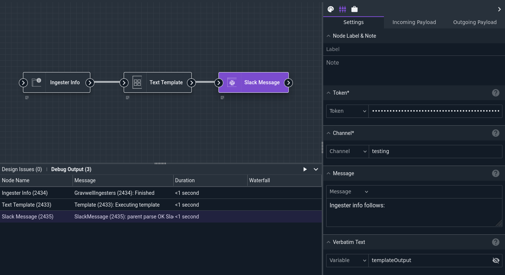
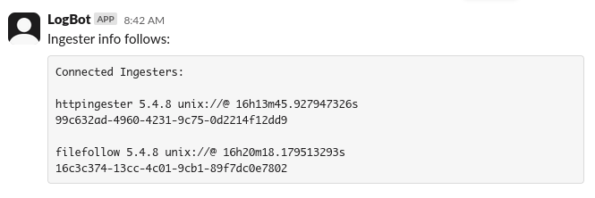

# Slack Message Node

The Slack Message Node sends a message to a Slack channel.

## Configuration

* `Token`, required: a [Slack access token](https://api.slack.com/authentication/token-types) for the desired server.
* `Channel`, required: the channel that will receive the message, *without* a preceding `#` character.
* `Message`: the message body; Markdown is supported.
* `Verbatim Text`: optional text which will be displayed *verbatim*, with no Markdown parsing.

## Output

The node does not modify the payload.

## Example

This example gathers information about currently-connected ingesters, formats that information into a text representation, and posts it to a Slack channel.



The [Text Template](template) node is configured with the following template:

```
Connected Ingesters:
{{ range .gravwell_ingesters }}
{{ .Name }} {{ .Version }} {{ .RemoteAddress }} {{ .Uptime }} {{ .UUID }}
{{ end }}
```

The output in Slack looks like this:



## Slack Bot Tokens and Scopes

The Slack Message node requires a valid Slack Bot token in order to send messages; a valid Slack Bot token will begin with the characters `xoxo`. Slack bots/apps must also be a member of the target workspace and channel as well as have access to the following OAuth scopes:

* `chat:write`: Allows the bot to send messages in chat.
* `incoming-webook`: Allows access to the webhook API to initiate message requests.
