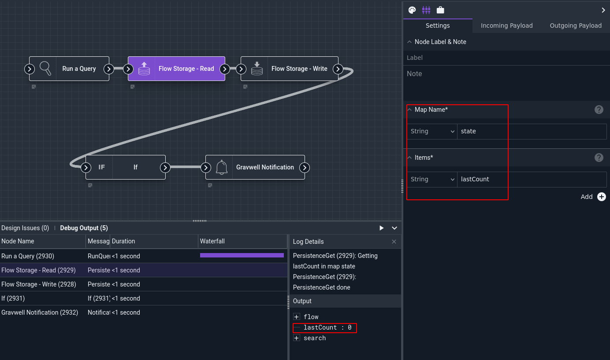
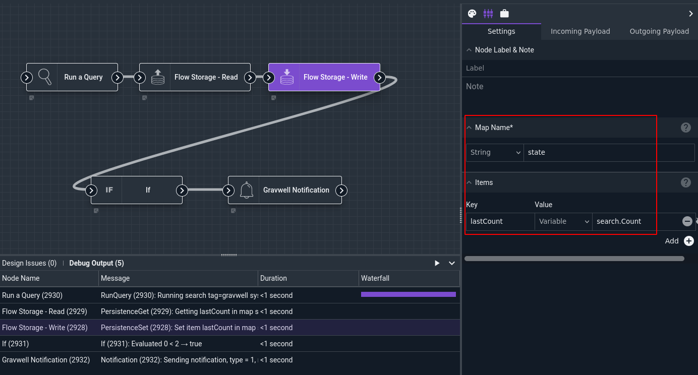
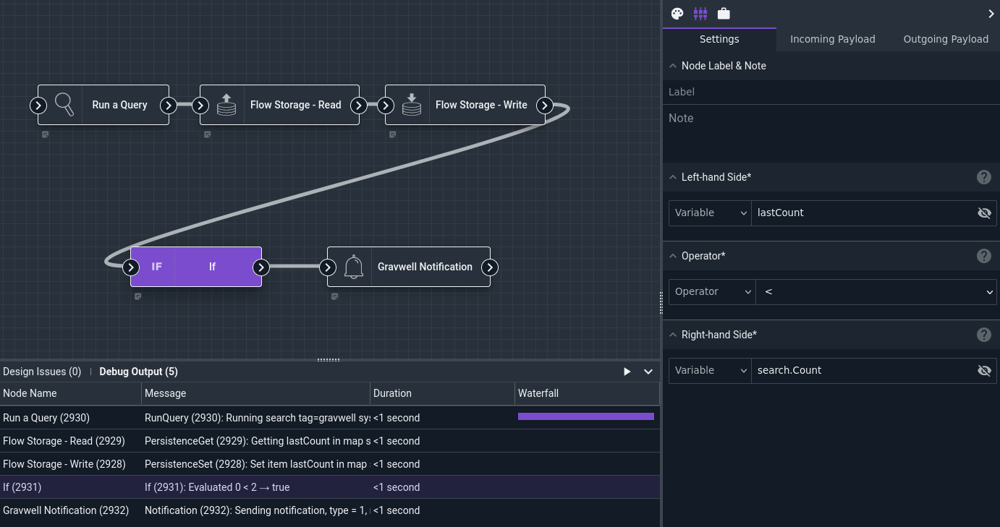

# Flow Storage Write

This node, in conjunction with the [Flow Storage Read node](storageread.md) enables users to persist data across different *runs* of a flow. Every flow can have multiple key-value maps, which persist from execution to execution. This can be used to record the last time an event occurred, or track how many times a particular hostname has been seen, etc.

The Flow Storage Write node stores items into a key-value map. The Flow Storage Read node pulls elements back out of a key-value map.

## Configuration

* `Map Name`, required: The name of the map to access. This can be almost anything, such as "state" or "previously seen systems".
* `Items`: a collection of key-value pairs to insert into the specified map. The key is a string, while the value is typically an item from the payload.

## Output

The node does not modify the payload.

## Example

This example checks if the number of authentication failures is increasing; it is a rather contrived example in order to keep the flow simple.


The [Run Query](runquery.md) node runs the following query:

```gravwell
tag=gravwell syslog Message=="Authentication failure"
```

Next, the [Flow Storage Read](storageread.md) node pulls the "lastCount" value from a persistent map named "state"; in this example, the previous value was 0:



Then, the Flow Storage Write node stores the number of search results from the *current* execution (`search.Count`) into the "storage" map; this is what will be read on the *next* run.



The If node compares the previous value (`lastCount`) with the current value (`search.Count`):



If there were more results in the current query than in the previous one, the Notification node sends a message to the user:


```{note}
The very first run of this flow will fail at the If node, because there was not yet anything in the persistent map. Re-running the flow will succeed.
```
