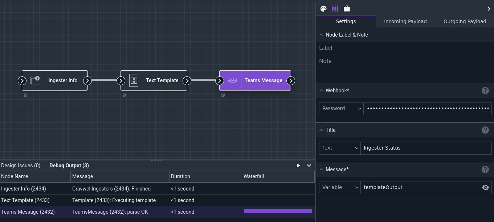

# Teams Message Node

The Teams Message node sends a message to a Microsoft Teams recipient.

## Configuration

* `Webhook`, required: an [incoming webhook](https://learn.microsoft.com/en-us/microsoftteams/platform/webhooks-and-connectors/how-to/add-incoming-webhook?tabs=newteams%2Cdotnet) URL for Microsoft Teams.
* `Title`: an optional title for the message.
* `Message`, required: the body of the message to send.

## Output

The node does not modify the payload.

## Example

This example gathers information about currently-connected ingesters, formats that information into a text representation, and posts it to a Teams channel.



The [Text Template](template) node is configured with the following template:

```
Connected Ingesters:
{{ range .gravwell_ingesters }}
{{ .Name }} {{ .Version }} {{ .RemoteAddress }} {{ .Uptime }} {{ .UUID }}
{{ end }}
```

The output in Teams looks like this:


### Creating a Teams Webhook

To learn how to create webhooks, visit the [Microsoft Documentation](https://support.microsoft.com/en-us/office/create-incoming-webhooks-with-workflows-for-microsoft-teams-8ae491c7-0394-4861-ba59-055e33f75498).

The ability to create Teams webhooks is controlled by system subscription levels and regions; depending on your Teams subscription level and/or permission level, you may not be allowed to create incoming webhooks.  Teams organizations in GovCloud cannot create incoming webhooks.

```{note}
Microsoft Teams has deprecated traditional Office365 Incoming Webhook funtionality. You may need to update your incoming webhook URLs.
```
