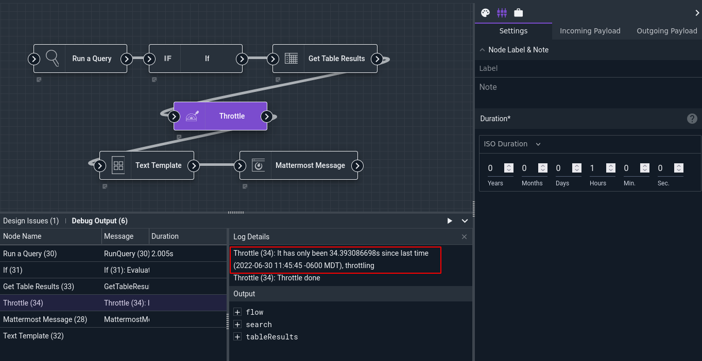

# Throttle Node

The Throttle node allows you to control how often certain nodes within a flow are executed. For instance, suppose you want to run a query every minute to check for a particular event, but you don't want to send out an *email* about that event more than once an hour. Injecting a Throttle node in front of the Email node accomplishes that.

## Configuration

* `Duration`, required: how long to wait between executions. The node will block any downstream nodes from executing if it has been less than Duration since the last time it allowed execution.

## Output

The node does not modify the payload.

## Example

This example runs a query which checks for ingesters disconnecting; if any are found, it generates a message listing them and sends that message to a Mattermost channel. The flow is configured to run *once a minute*, but to avoid spamming Mattermost we will only send a message *hourly* at most.



Note that in the screenshot above, the Throttle node has blocked further execution of the Text Template and Mattermost Message nodes, because it has only been 34 seconds since the last successful execution.

The [Run Query](runquery) node is configured to run the following query over the last hour:

```gravwell
tag=gravwell syslog Hostname Message~"Ingest routine exiting" Structured.ingester Structured.ingesterversion Structured.ingesteruuid Structured.client 
| alias Hostname indexer 
| regex -p -e client "://(?P<client>.+):\d+" 
| stats count by indexer ingesteruuid client 
| table indexer ingester client ingesterversion ingesteruuid count
```

The [If](if) node checks if `search.Count` is greater than 0. If so, the [Get Table Results](gettableresults) node fetches those results as a table.

The Throttle node is configured with a Duration of 1 hour. When the flow is run for the first time, it will allow downstream execution to continue and note the current time. The next time the flow is run, the Throttle node will check if it has been more than an hour since the last time it allowed execution. If so, it allows execution again and updates the stored timestamp; otherwise, it blocks further execution.

The [Text Template](template) node generates a simple message from the table results:

```
Bounced ingesters:
{{ range .tableResults.Data }}
{{  index  . 1 }}
{{ end }}
```

And the [Mattermost Message](mattermost) node sends the results to a Mattermost channel:


