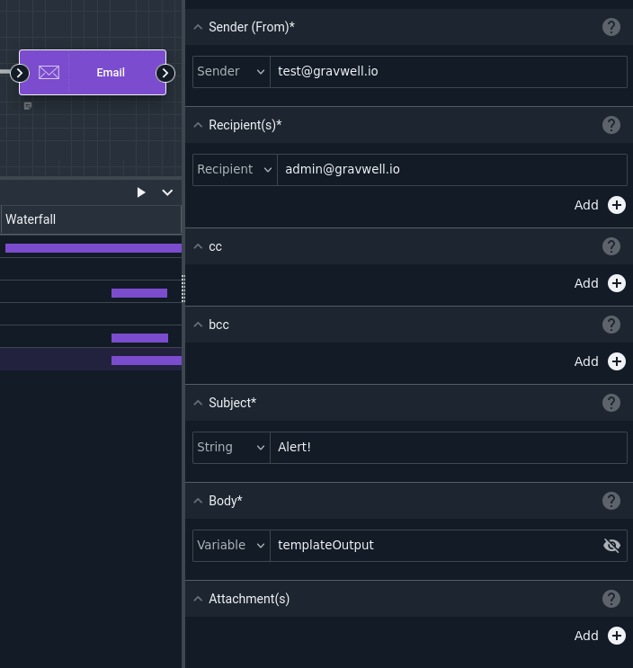
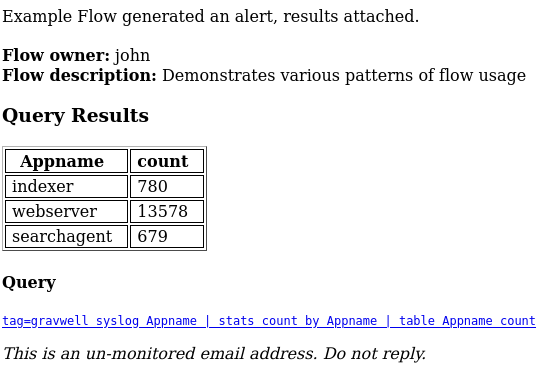
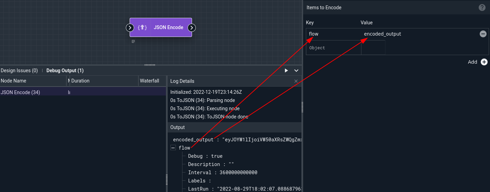
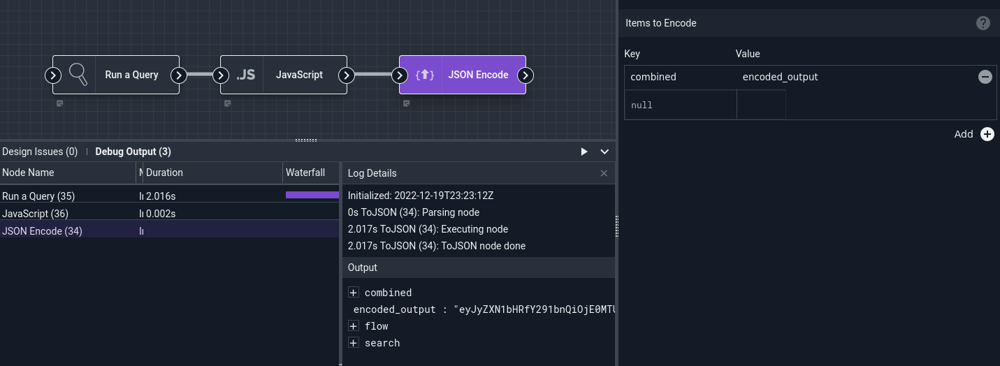
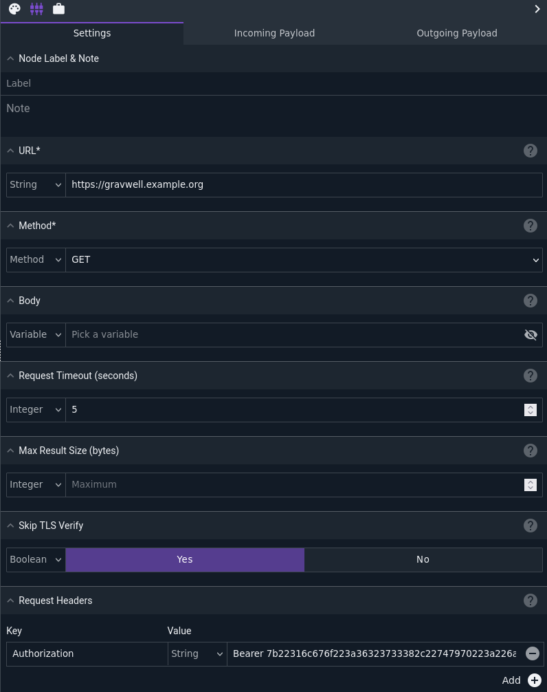

# Common Flow Patterns

This page demonstrates how to accomplish some common tasks in the flows system.

## Build an HTML email body with query results

A very common use-case for flows is to run one or more queries, check if there were results, and send an alert email if so. The following flow implements the basics:


The [Run Query](/flows/nodes/runquery) node executes a search using the table renderer; for the sake of the example we use `tag=gravwell syslog Appname | stats count by Appname | table Appname count`. We then use the [If](/flows/nodes/if) node to check if `search.Count` is greater than 0. If there were results, the flow will continue on to format and send the email.

Immediately after the If node, we use the [Get Table Results](/flows/nodes/gettableresults) node to fetch the actual results of the query. Then we use the [Set Variables](inject) node to inject the Gravwell system's hostname into the payload, for our convenience in the next step:


The next node is the most complex. We use the [Text Template](/flows/nodes/template) node to format our search results into a nice HTML email and place the formatted text into a variable named `templateOutput`:


The full template definition is below:

```
<!DOCTYPE html PUBLIC “-//W3C//DTD XHTML 1.0 Transitional//EN” “https://www.w3.org/TR/xhtml1/DTD/xhtml1-transitional.dtd”>
<html xmlns=“https://www.w3.org/1999/xhtml”>
<head>
<style>
th, td {
  border: 1px solid black;
  padding-right: 10px;
  white-space: pre;
}
</style>
</head>
<body>

<div>{{ .flow.Name }} generated an alert, results attached.</div>
<br>
<div><b>Flow owner:</b> {{ .flow.User }}</div>
<div><b>Flow description:</b> {{ .flow.Description }}</div>


<h3> Query Results</h3>
<table border="1">
<tr>{{ range .tableResults.Headers }} <th>{{ . }}</th>{{ end }}</tr>
{{ range .tableResults.Data }}
   <tr>{{ range . }} <td> {{ . }} </td> {{ end }}</tr>
{{ end }}
</table>

<h4>Query</h4>
<a href="https://{{.hostname}}/search/launch?query={{urlquery .search.Query}}&start={{.search.Start}}&end={{.search.End}}"><pre>{{ .search.Query }}</pre></a>

<p><i>This is an un-monitored email address. Do not reply.</i></p>
</body>
</html>
```

Finally, the [Email](email) node is configured to send the output of the Template node to our designated recipient:



The resulting email looks like this:



Note that the text template is reasonably generic: it will work properly regardless of what query you use, because it generates the email on the fly based on the contents of the payload.

## Build an arbitrary JSON object

It is often necessary to encode data as JSON, usually in preparation for sending it to an HTTP endpoint. Sometimes it is enough to just use the [JSON Encode](/flows/nodes/json) node by itself; in the example below, we encode the `flow` object from the payload into a variable named `encoded_output`, which is shown as base64-encoded data in the payload result:



However, it is sometimes necessary to combine multiple objects from the payload into a single JSON structure. For instance, suppose we wish to send an HTTP endpoint the flow's scheduled execution time (`flow.Scheduled`) and the number of results from a Gravwell query (`search.Count`)? We can use the [Javascript](/flows/nodes/javascript) node and the JSON Encode node in concert.

First, we configure the Javascript node with the following script and specify that there will be an output named `combined`. The screenshot below shows this configuration; it also shows how the Javascript node creates an object in the payload named `combined` which contains the specified fields:

```
payload.combined = {
    "result_count": payload.search.Count,
    "scheduled_time": payload.flow.Scheduled
}
```


Then we tell the JSON Encode node to encode the `combined` variable into `encoded_output`:



When decoded from base64, the `encoded_output` variable contains the following:

```
{"result_count":14158,"scheduled_time":"2022-12-19T23:23:12.490597301Z"}
```

## Go from a curl command to an HTTP node

It's common to see examples of API access as `curl` invocations. These can be easily translated to the [HTTP flow node](/flows/nodes/http). Consider the following curl invocation, which fetches a list of notifications from a Gravwell server:

```
curl 'https://gravwell.example.org/api/notifications' -X GET --max-time 5 
--insecure -H 'Authorization: Bearer 7b22316c676[...]3989'
```

Here's the same request accomplished via the HTTP node:



* `https://gravwell.example.org/api/notifications`: set the same URL in the "URL" config.
* `-X GET`: select GET in the "Method" config.
* `--max-time 5`: set "Request Timeout" to 5.
* `--insecure`: set "Skip TLS Verify" to true.
* `-H 'Authorization: Bearer 7b22316c6...'`: click Add in the "Request Headers" config, set the Key to "Authorization" and the Value to "Bearer 7b22316c6..."
