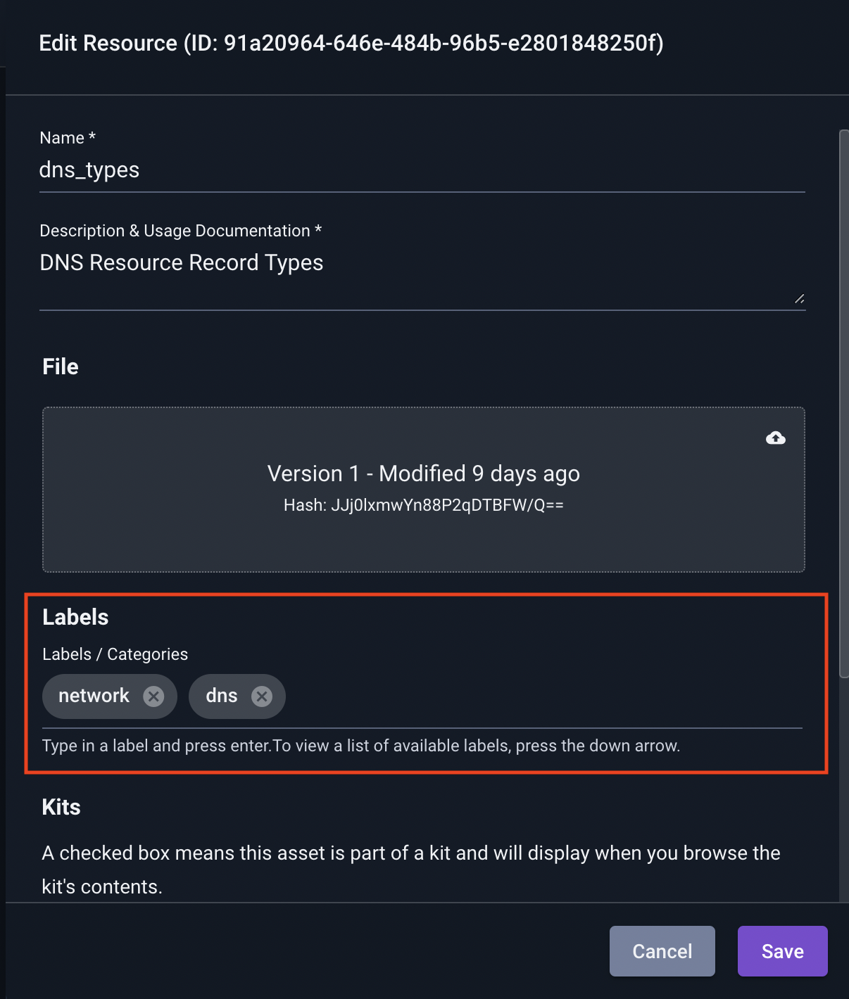

# Labels and Filtering

Objects in Gravwell such as dashboards, resources, macros, etc. can be *labeled* for organizational purposes. Some objects distributed in kits may be pre-labeled for convenience. The following object types can be labeled:

* Extractors
* Dashboards
* Kits
* Playbooks
* Resources
* Scheduled Searches / Automation Scripts
* Macros
* Templates
* Actionables
* Query Library entries
* User files

## Defining Labels

Labels are added or deleted in the edit dialog for a given object. While the exact layout of the dialog varies for each object type, they will all have a section for Labels. Labels are added by typing the label into the text bar and hitting enter. Multiple labels can be added in succession in this manner. In this screenshot, the user has added three labels, "network", "asn", and "lookup" to a resource:



To delete a label, click the 'x' icon next to label.

## Filtering

The GUI can filter objects based on their labels. At the top of many screens is a bar containing a "Filters" button, as shown below.


Clicking that button brings up a menu with several options for filtering:


```{note}
All the filters described below can be combined with each other. A blue "X" button will appear on the Filters button when a filter is set; click it to clear all filters.
```

### Filter by label

The left-most dropdown, "Filter by label or kit", allows you to select one or more labels or kits; clicking the Apply button will then show only those objects with the specified labels or installed by the specified kits. The screenshots below show the user selecting the "lookup" label, which reduces the display down to just three resources:


### Filter by owner

By default, most interfaces will show all objects the user has access to, regardless of owner. Another filter option can make it show only objects owned by a particular set of users. The screenshots below show the user filtering macros to show only those macros owned by the user "John":


### Show hidden

Objects with the special label "hidden" are not displayed by default. This is a convenience function which can keep displays clear of rarely-accessed objects. Click the "Show hidden record" toggle to show hidden objects. In the screenshot below, toggling "Show hidden record" reveals an additional hidden macro:


## Special Labels

Gravwell defines a handful of special labels and label prefixes for particular operations.

### Hidden

The string "hidden" is a special label; applying it to an object will prevent the object from being displayed by default. To see the object, toggle the "Show hidden record" option in the filter menu, as detailed above.

### Kit Label Prefixes

Three label *prefixes* are used to manage Gravwell-internal information about objects which were installed as part of a kit. You should **never** manually apply kit labels to objects; these labels are documented to prevent users from accidentally applying a conflicting label to an object. The following are considered reserved kit label prefixes:

* `kit/`
* `kit/dependency:`
* `kit/configuration:`

Users should not create labels beginning with these strings, e.g. "kit/foo" or "kit/dependency:bar". These labels are managed internally by Gravwell.
