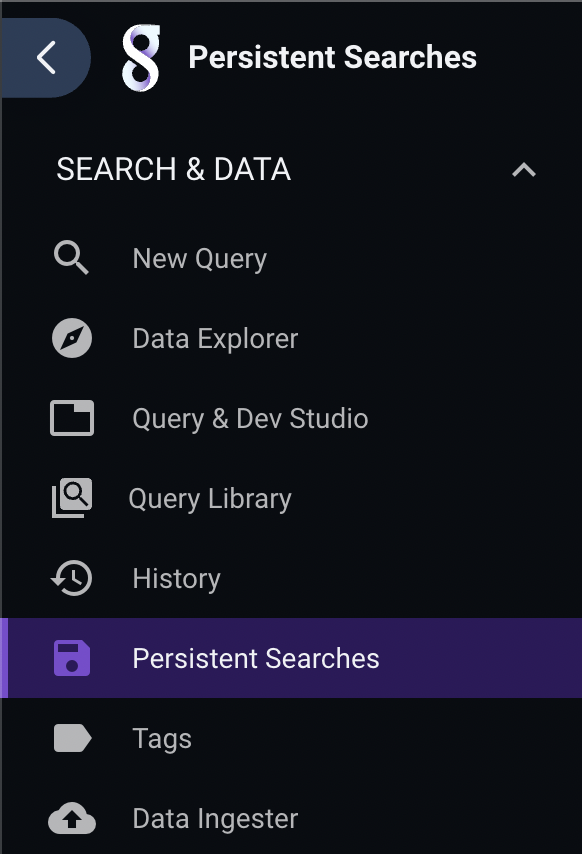
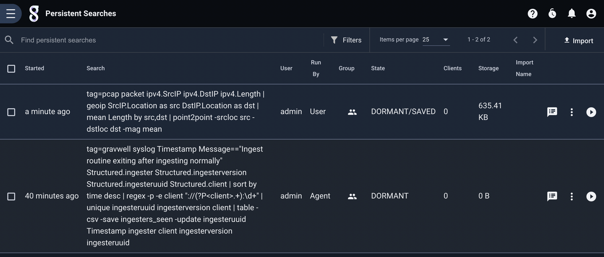
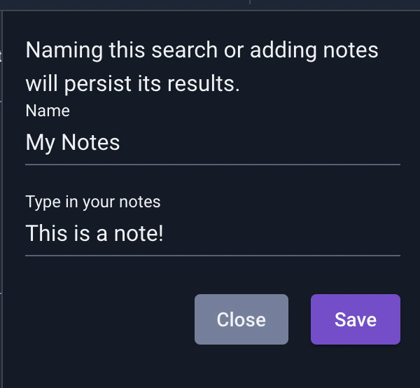
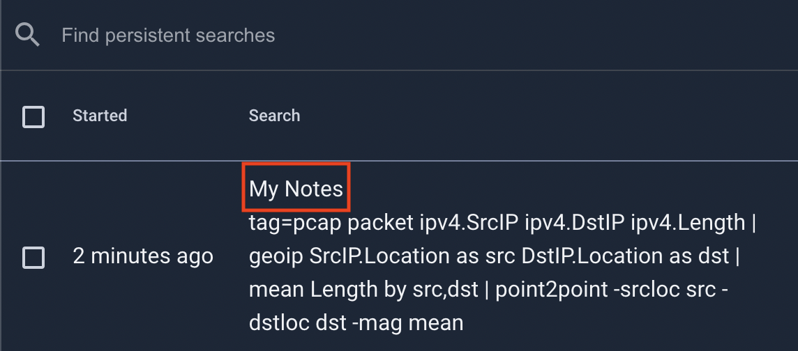
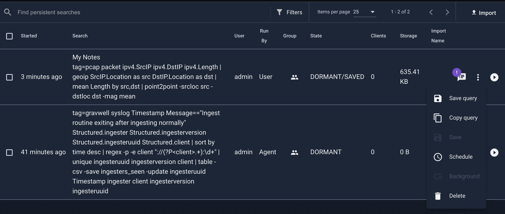

# Persistent Searches

Gravwell users may wish to [send long-running searches to the background](background_search) or [save search results](search_results), or [schedule searches](/scripting/scheduledsearch) to run periodically. To review the search results at a later time, use the *Persistent Searches* page, found in the Searches section of the main menu:

The persistent searches page will periodically update to show the current state. It will display searches belonging to the user or shared with the user. In the screenshot below, we see two searches:

The top search was run by the user manually one minute ago. We see that it is in the ACTIVE state and has 1 client attached, meaning the user is still viewing the search in another browser tab. The results of the search consume 328 bytes on disk.

The second search was run by the search agent, as indicated by 'Agent' in the Run By column. It is in the DORMANT state, which means that the search will remain available until it is deleted or the webserver restarts.

## Search States

Every search within Gravwell has a *state*, but this state is not typically visible to users. However, knowing the state may be valuable when managing searches in the persistent searches page, so it is shown there. The following states are possible:

* ACTIVE: The search is either running or has just completed running, and there is still a client (typically a user's browser) attached to it.
* DORMANT: The search has completed and has no clients attached. It can be opened again, but is not guaranteed to persist across webserver restarts. Backgrounded searches are marked DORMANT after completion.
* ATTACHED: The search has completed previously and gone dormant, but a client has now re-attached to it.

The flag SAVED is appended to searches which the user has explicitly marked to save, e.g. "DORMANT/SAVED".  The results will persist across webserver restarts. Note that an ACTIVE search will be marked "ACTIVE/SAVING" because the search has not yet completed and thus cannot be fully saved.

There is another flag, BACKGROUNDED, which may be attached to an ACTIVE search, e.g. "ACTIVE/BACKGROUNDED"or even "ACTIVE/SAVING/BACKGROUNDED". This means the user has sent the search to the background and will review it later. If a search is not backgrounded, the search will be canceled and deleted if the user navigates away from the active search results page.

See the [search interface documentation](/gui/queries/queries) for more information on saving and backgrounding searches.

## Viewing Results

To view the results of a search, click the 'View Results' icon on the right edge of that search's row:

Note that this does not *re-run* the search; instead, it loads the results from the previous search which are stored on the webserver's disk. This means that even very old searches whose original data has been [aged out](/configuration/ageout) can be viewed.

## Adding Notes

You can add a note to any search in the persistent searches page by clicking the 'Add Note' icon. A dialog will open in which you can enter a name for the search and a brief note.

Once you have saved the note, the name you defined will be displayed above the query string. Be aware that adding a note will automatically mark the search as SAVED--we assume that anything you consider important enough to take notes on should be preserved!

## Additional Actions

Searches in the persistent searches page have a menu of additional actions which can be accessed through the icon showing three vertical dots:

* Save query: Stores the query string in a [query library](/gui/querylibrary/querylibrary) entry.
* Copy query: Copies the query string into the clipboard.
* Save: Marks the search as saved.
* Schedule: Brings up a page to create a new [scheduled search](/scripting/scheduledsearch) using that query.
* Background: For an active search, marks it as backgrounded.
* Delete: Removes the search from the system.
