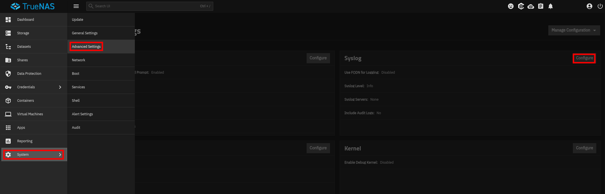

# TrueNAS

:::{csv-table}
:align: left
:width: 45%
:widths: 15, 25
**Integration Details**
    Ingester, [Simple Relay](/ingesters/simple_relay)
:::

## TrueNAS Configuration

TrueNAS SCALE has native remote syslog forwarding. See [Managing System Logging](https://www.truenas.com/docs/scale/systemsettings/advanced/managesyslogs/) and [Advanced Settings Screen](https://www.truenas.com/docs/scale/systemsettings/advanced/advancedsettingsscreen/).



1. Go to **System Settings > Advanced > Syslog** and click **Configure**.
2. Set **Host** to your Gravwell Simple Relay address, followed by the port of the matching listener from the sample below: `:514` for UDP, `:601` for TCP, or `:6514` for TLS.
3. Set **Transport** to UDP, TCP, or TLS.
4. If using TLS, import a certificate under **Credentials > Certificates** first, then select it here. TLS requires the TLS listener in the sample below.
5. Set the **Syslog Level** (minimum severity to forward). Up to two independent remote syslog servers can be configured.

## Gravwell Configuration

### Gravwell Storage Well Configuration

Set up the well configuration in your Gravwell indexers.

**Sample well config:**  
Create or edit: `/opt/gravwell/etc/gravwell.conf.d/truenas-well.conf`
```ini
[Storage-Well "truenas"]
    Location=/opt/gravwell/storage/truenas
    Tags=truenas*
```

### Gravwell Ingester Configuration: Simple Relay

**Sample TrueNAS config:**  
Create or edit: `/opt/gravwell/etc/simple_relay.conf.d/truenas.conf`
```ini
[Listener "truenasudp"]
    Bind-String="udp://0.0.0.0:514"
    Reader-Type=rfc5424
    Tag-Name=truenas
    Assume-Local-Timezone=true #if a time format does not have a timezone, assume local time
    Keep-Priority=true # leave the <nnn> priority tag at the start of each syslog entry

[Listener "truenastcp"]
    Bind-String="tcp://0.0.0.0:601"
    Reader-Type=rfc5424
    Tag-Name=truenas
    Assume-Local-Timezone=true #if a time format does not have a timezone, assume local time
    Keep-Priority=true

# Only needed if you select TLS in TrueNAS. Replace the certificate and key paths with your own.
[Listener "truenastls"]
    Bind-String="tls://0.0.0.0:6514"
    Cert-File=/opt/gravwell/etc/cert.pem
    Key-File=/opt/gravwell/etc/key.pem
    Reader-Type=rfc5424
    Tag-Name=truenas
    Assume-Local-Timezone=true
    Keep-Priority=true
```

```{note}
Remember to restart the service to apply the new config:
`sudo systemctl restart gravwell_simple_relay.service`
```
