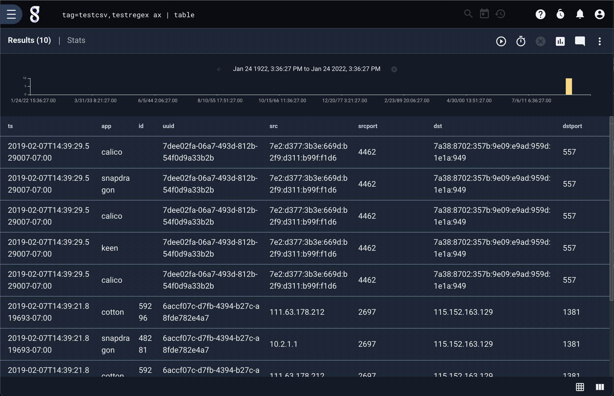

## AX

The ax module is a wrapper module which uses pre-extraction rules to extract fields from data by invoking the functionality of other modules.  It can significantly simplify queries which use data that is not self-describing, standard, or structured.

As of release 4.2.0 the following AX processors are available:

* [CSV](../csv/csv.md)
* [fields](../fields/fields.md)
* [ipfix](../ipfix/ipfix.md)
* [json](../json/json.md)
* [KV](../kv/kv.md)
* [netflow](../netflow/netflow.md)
* [regex](../regex/regex.md)
* [slice](../slice/slice.md)
* [syslog](../syslog/syslog.md)
* [winlog](../winlog/winlog.md)

For full documentation on the configuration of AX extractors, see the [autoextractor section](../../configuration/autoextractors.md).

### Filtering

The ax module supports inline filtering on extracted values using the same filtering semantics as the underlying processor.  Each processor may support a specific subset of filter operators.

For example the CSV, fields, and regex processors support limited equality filters (== != ~ !~) where the slice processor supports specific filters depending on the type cast.

| Operator | Name | Description |
|----------|------|-------------|
| == | Equal | Field must be equal
| != | Not equal | Field must not be equal
| ~ | Subset | Field contains the value
| !~ | Not Subset | Field does NOT contain the value
| < | Less Than | Numeric value of field is less than
| <= | Less Than or Equal to | Numeric value of field is less than or equal to
| > | Greater Than | Numeric value of field is greater than
| >= | Greater Than or Equal to | Numeric value of field is greater than or equal to

```{note}
Every operator is not supported by every processor.  If multiple tags extract fields with the same name, the filter operator set will be restricted to a common subset.
```

### Invoking AX

The AX module can process multiple tags with multiple custom processors at the same time.  This means that if you have a tag named "foo" which contains CSV data and a tag named "bar" that contains unstructured data you can use ax to seamlessly process both streams with a single invocation.  Here is an example of two different data formats (CSV and unstructured):

```
2019-02-07T14:39:21.819693-07:00,cotton,59296,6accf07c-d7fb-4394-b27c-a8fde782e4a7,111.63.178.212,2697,115.152.163.129,1381
2019-02-07T14:39:29.529007-07:00 [calico] <7dee02fa-06a7-493d-812b-54f0d9a33b2b> 7e2:d377:3b3e:669d:b2f9:d311:b99f:f1d6 4462 7a38:8702:357b:9e09:e9ad:959d:1e1a:949 557
```

We will assume that the CSV data is tagged "testcsv" and the unstructured data is tagged "testregex". The two data formats are very different, but do contain some common data fields.  We can use the following auto-extraction definitions for each data format:

```
[[extraction]]
	name="regex"
	module="regex"
	tag="testregex"
	params='(?P<ts>\S+)\s\[(?P<app>\S+)\]\s<(?P<uuid>\S+)>\s(?P<src>\S+)\s(?P<srcport>\d+)\s(?P<dst>\S+)\s(?P<dstport>\d+)'

[[extraction]]
	name="csv"
	module="csv"
	tag="testcsv"
	params="ts, app, id, uuid, src, srcport, dst, dstport"
```

Using AX and the ax module we can specify both tags ("testregex" and "testcsv") and extract the common fields and unify them into a single view:

```gravwell
tag=testregex,testcsv ax app src dst | ip src as IP | subnet IP /16 | count by subnet | sort by count desc | table -nt subnet count
```


AX does not *require* arguments.  If no arguments are given to ax, the module will extract all fields specified with the extractions.  Given the same two data sets with the same extraction configurations we can issue the extremely simple query:

```gravwell
tag=testregex,testcsv ax | table
```



We can also add filtering to specify that we only want entries which match the given filters:

```gravwell
tag=testregex,testcsv ax dstport==1381 | table app src dst
```


