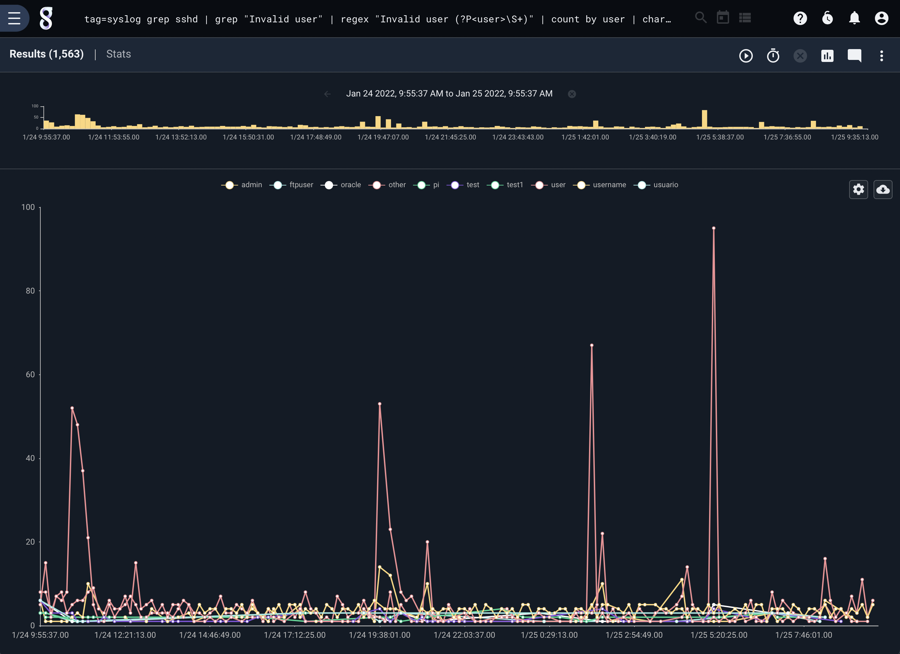
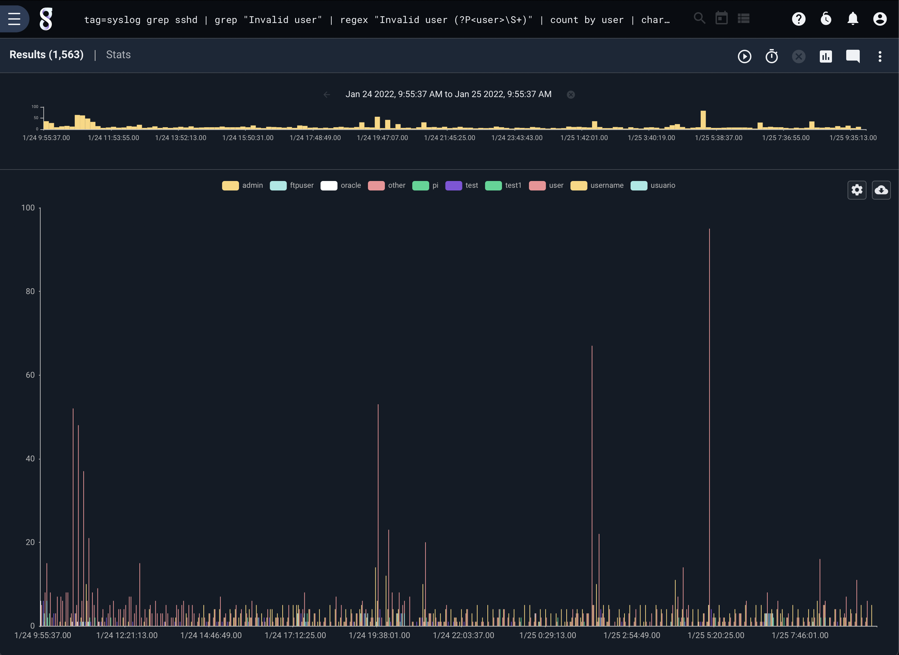
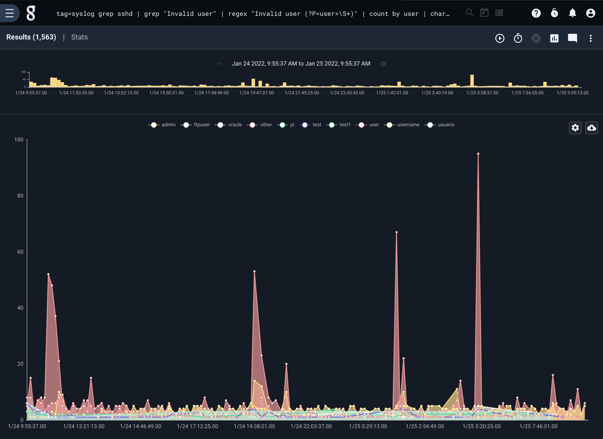
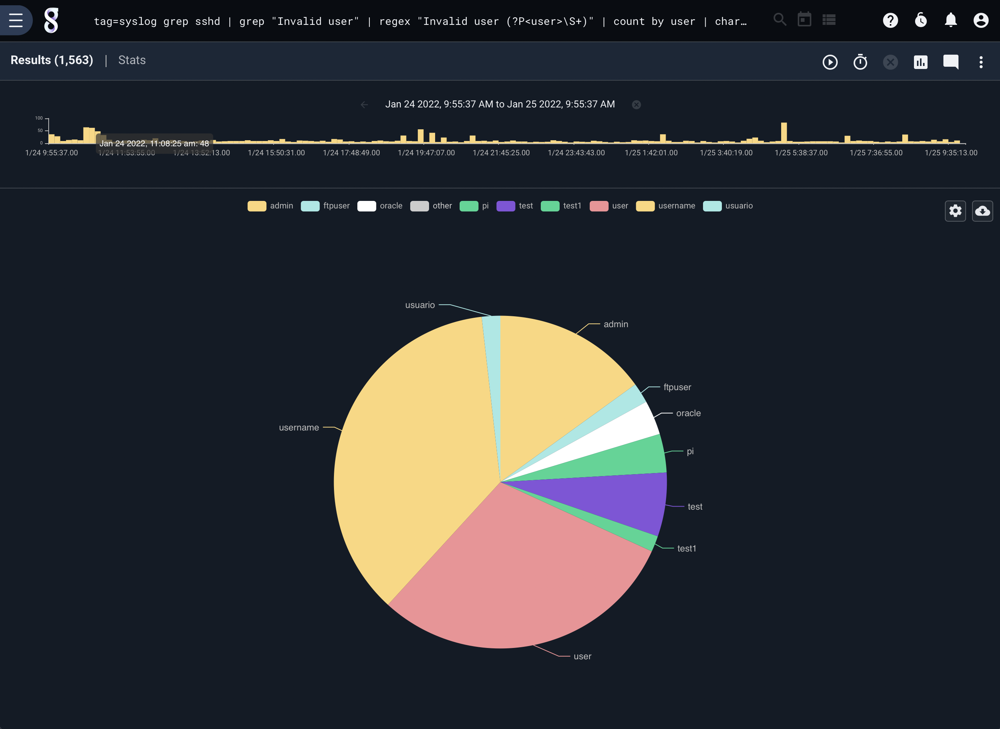
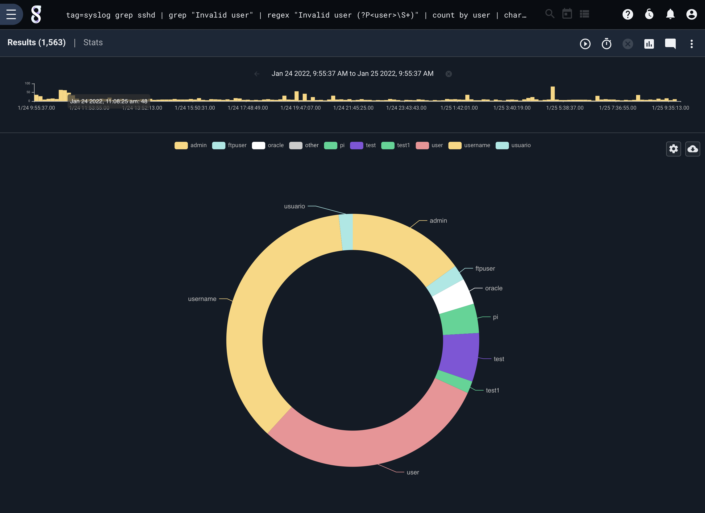
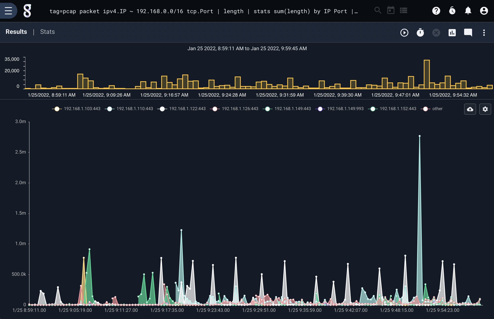
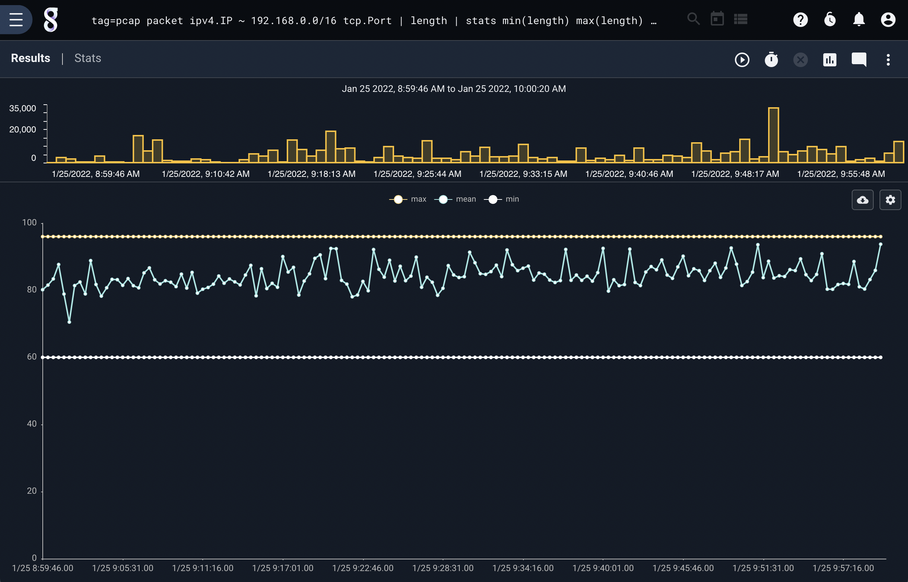
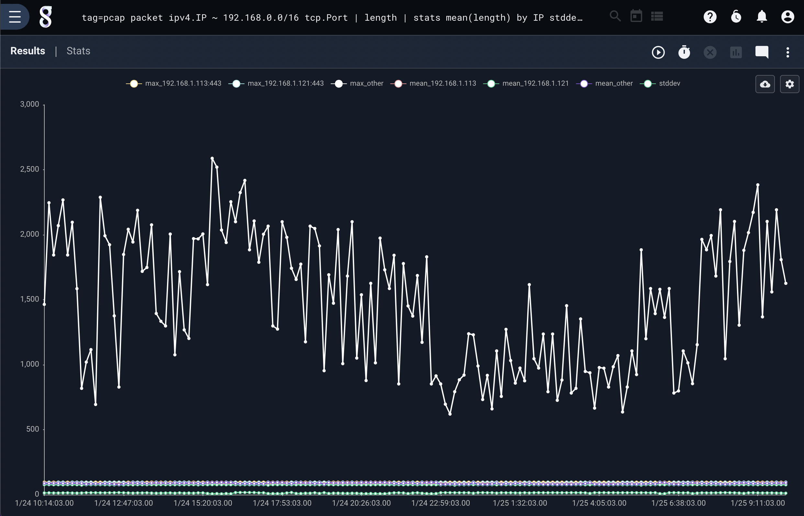
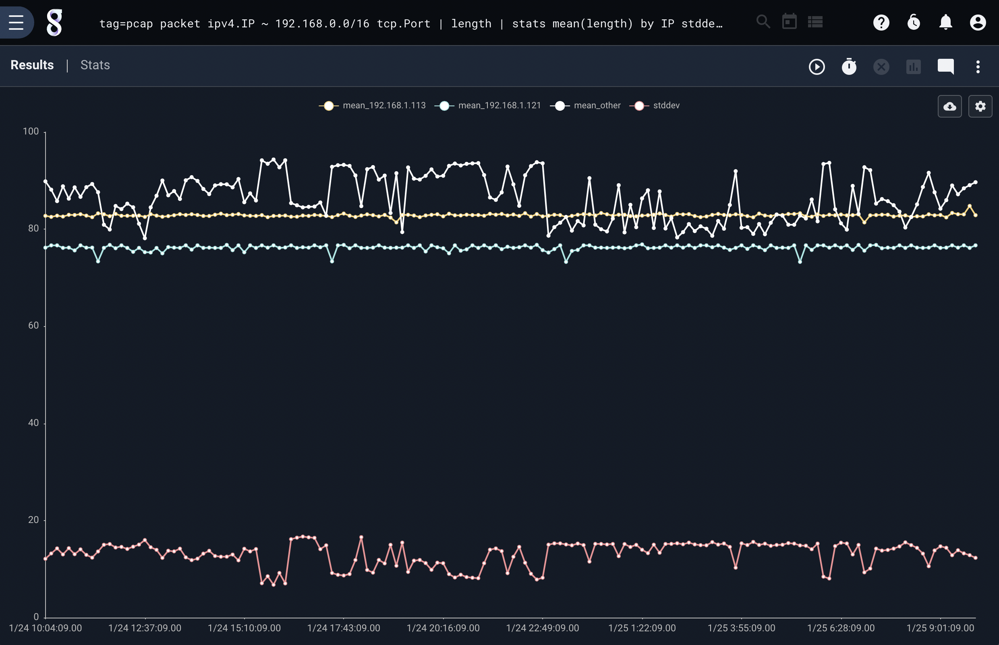

# Chart

The chart renderer is used display aggregate results such as trends, quantities, counts, and other numerical data. Charting will plot an enumerated value with an optional “by” parameter. For example, if there are counts associated with names, `chart count by name` will chart a line for each name showing the counts over time.

The `chart` render module is a condensing module that collapses and recalculates data in order to show an accurate representation of data for a given timespan.  As you dig into data and zoom in, the chart renderer is constantly re-condensing the results of a search without rerunning the query.
## Sample Query

The following query generates a chart showing which usernames most commonly fail ssh authentication; due to online brute-forcing attacks, we can expect "root" to be the most common.

```
tag=syslog grep sshd | grep "Failed password for" | regex "Failed\spassword\sfor\s(?P<user>\S+)" | count by user | chart count by user limit 10
```







## Charts with Keys

The `chart` renderer can produce data sets based on keys.  In the above examples we are plotting the `count` of entries using the key `user` which produces a count for each user user.  Chart supports multiple keys, which would allow us to chart data using the intersection of multiple key values.  For example we can run a query that calculates the size of data for each IP and Port using PCAP.  The query and results would be:

```
tag=pcap packet ipv4.IP ~ 192.168.0.0/16 tcp.Port | length | stats sum(length) by IP Port | chart sum by IP Port
```




Notice that chart generated a legend with the IP and Port concatenated, the key for each sum is the intersection of the IP and Port.

## Multiple Chart Categories

The `chart` renderer can also plot multiple independent data sources.  We might want to plot the min, max, and mean of a stream of data.  Chart allows for specifying multiple groups of data.

The following query generates the `min`, `max`, and `mean` of packet lengths over time and displays the results on a single chart:

```
tag=pcap packet ipv4.IP ~ 192.168.0.0/16 tcp.Port | length | stats min(length) max(length) mean(length)| chart min max mean
```



Note: Multiple value types on a single chart are called categories.


Charts can use multiple keys and categories, it is perfectly acceptable to plot the `min`, `max`, and `mean` using a set of keys.  This query plots the `min`, `max`, and `mean` of packet sizes using the `IP` and `Port` keys.  The chart can get a little busy, but the output can still be useful.

```
tag=pcap packet ipv4.IP ~ 192.168.0.0/16 tcp.Port | length | stats min(length) max(length) mean(length) by IP Port | chart min max mean by IP Port
```



## Intelligent Keying with Multiple Categories

The `chart` renderer utilizes the Gravwell pipeline to decide how to key and condense multiple categories.  It is intelligent enough to identify the correct keys that generated a data category and condense using those keys.  This allows us to generate very complex charts with multiple categories that do not have uniform key sets.  For example, maybe we want mean packet sizes for each IP, but we want the standard deviation of packet sizes for everything.  This can be accomplished using the following query:

```
tag=pcap packet ipv4.IP ~ 192.168.0.0/16 tcp.Port | length | stats mean(length) by IP stddev(length) over 1m | chart stddev mean by IP limit 3
```



Chart can handle even more complex category and key interactions, here is a query that plots the mean of packet lengths by IP, and the max packet for each IP Port, and the standard deviation of all packet lengths.

Note: Notice that we provide all the categories and a single set of keys that covers all keys used for the categories.  Chart will figure out which keys go to which category and *do the right thing*.

```
tag=pcap packet ipv4.IP ~ 192.168.0.0/16 tcp.Port | length | stats mean(length) by IP stddev(length) max(length) by IP Port over 1m | chart stddev max mean by IP Port limit 3
```


## Chart Limiting and Grouping

The charting renderer will automatically limit the plotted lines or bar groups to 8 values. If you would like to see many more lines you can add the `limit <n>` argument which tells the charting library to not introduce the “other” grouping until it exceeds the given limit of `n` values. The user interface for charting allows for a rapid transition between line, area, bar, pie, and donut charts.  If there are more groups than the allowable limits, chart generates an `other` group that is comprised of everything not in the displayed groups.  The limit maximum specifies the total number of data sets for a category; if the limit is 4 there may be 3 keyed sets and 1 other group.

The chart renderer runs a pre-scan at the beginning of every query in order to determine which data sets will be drawn and which will be grouped into the `other` group.  Chart will scan until either 1/3 of the query timespan is covered, or it receives enough data to make a decision.  If multiple data sets are being drawn, chart creates an other group for each category of data if needed.  For example, if we were running a query with the following chart parameters `chart foo bar baz by X` there might be three other groups, one for each category `foo`, `bar`, `baz`. 

### Example Other

Consider the query `tag=netflow netflow IP~PRIVATE Bytes | stats sum(Bytes) by IP | chart sum by IP` where we sum up the total bytes per private IP in netflow records and chart it.  Even small networks will contain more than 8 hosts, which means that the chart module will create an other bucket.  Here is how that query looks by default:


We can modify the query to allow for more data groups by appending the limit keywords `tag=netflow netflow IP~PRIVATE Bytes | stats sum(Bytes) by IP | chart sum by IP limit 32`.  Note that there are many more data groups in the chart, but overall the chart does not look substantially different.


The "other" bucket calculates results and generates an output using the same math as other data buckets.  This means that if you had 1000 IPs all creating about 1KB/s of data then the "other" data set will be substantially larger than the other lines because it is the summation of 993 IPs.  This is to say that an "other" bucket is properly calculated using the same math as named data buckets and not just a mean of all other outputs.
