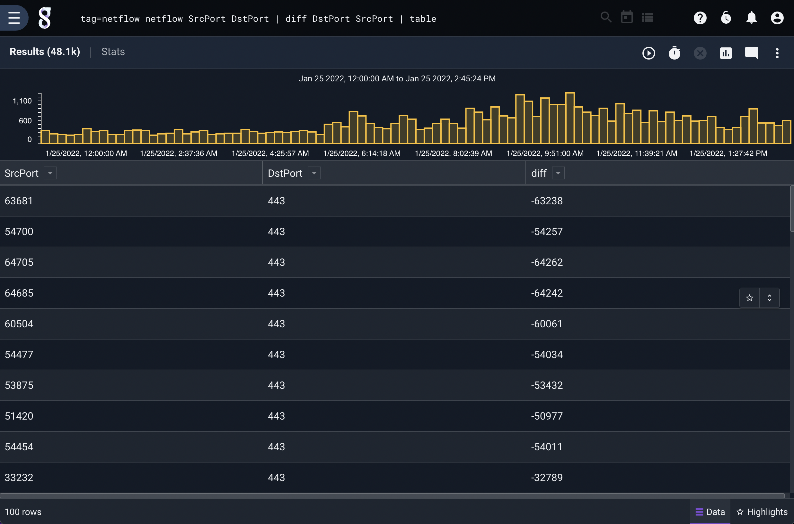
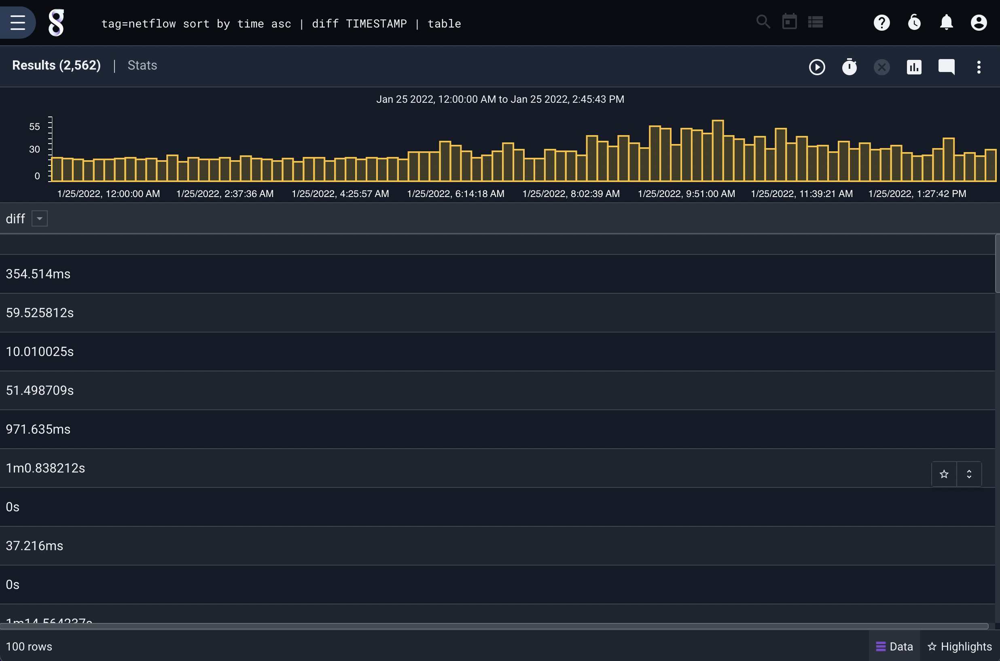
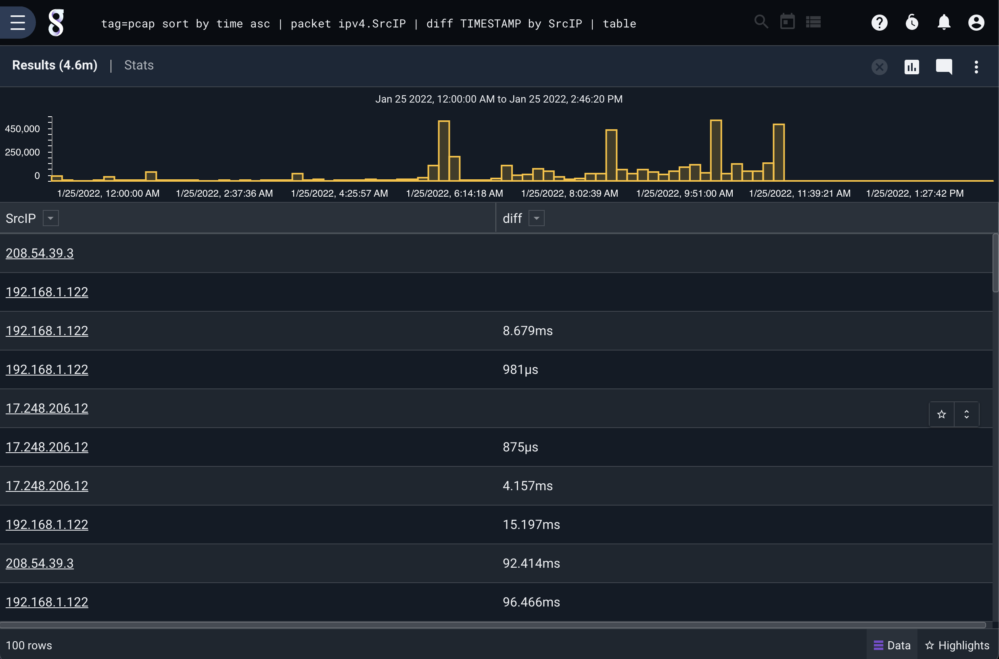

# Diff

The diff module finds the difference between enumerated values. It can operate in two modes:

1. Find the difference between two enumerated values on the current entry. ("Normal mode")
2. Find the difference between an enumerated value on the current entry, and the same enumerated value on the *previous* entry. ("Temporal mode")

The module can find the difference between integers, floating point numbers, timestamps, and time durations. If an enumerated value is a string, diff will attempt to parse the string as a number first.

## Examples

You can find the difference between two values by specifying the two enumerated value names as arguments; the second will be subtracted from the first. The following will generate enumerated values named "diff" containing DstPort - SrcPort:

```gravwell
tag=netflow netflow SrcPort DstPort | diff DstPort SrcPort | table
```



(Not particularly useful, but it demonstrates how the tool works)

The following query uses the other mode; it compares the TIMESTAMP field of the current entry against that of the previous entry to see how frequently netflow packets are arriving:

```gravwell
tag=netflow sort by time asc | diff TIMESTAMP | table
```



## Output options

By default, the module will create a new enumerated value named `diff` containing the calculated difference. You can change the name with the "as" keyword, e.g.:

```
diff foo bar as foobarDiff
```

## Keying

When in temporal mode (comparing an enumerated value against its value in the previous entry), diff can store multiple "previous entries" based on a specified key set. The following query extracts the source IP address from network packets and checks how long it's been since that IP has been seen:

```gravwell
tag=pcap sort by time asc | packet ipv4.SrcIP | diff TIMESTAMP by SrcIP | table
```

