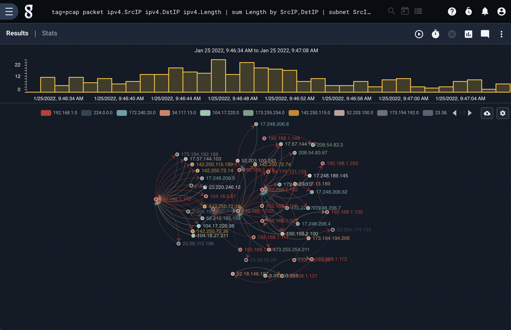
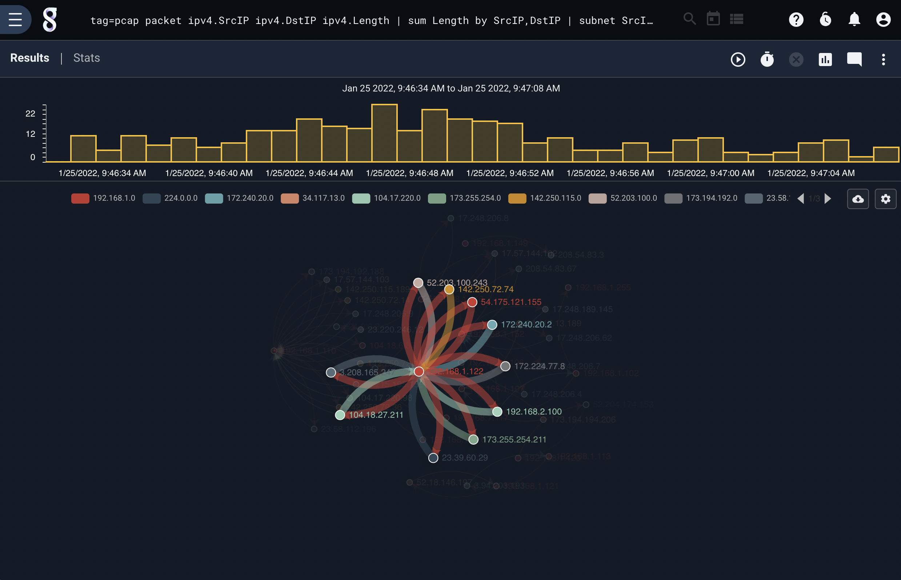
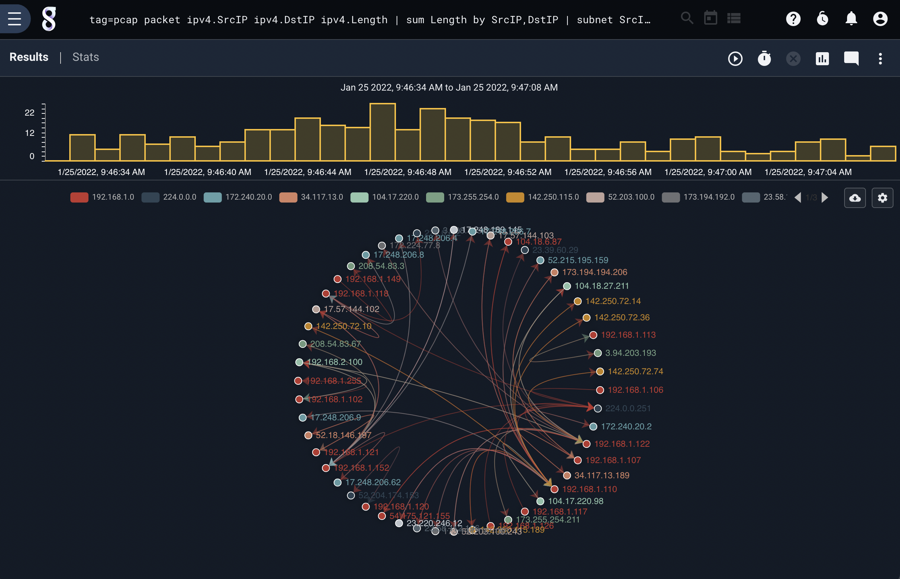

# Force Directed Graph

The force directed graph (fdg) module is used to generate a directed graph using node pairs and optional grouping. The fdg module accepts source and destination groups as well as a weight value for the resulting edge.

## Supported Options
* `-b`: Indicates that edges are bidirectional, meaning that the pair [A, B] is equivalent to [B, A]
* `-v <enumerated value>`: Indicates that edges should be weighted as a sum of the provided enumerated value. The `-v` flag is useful in generating directed graphs where edges have weights represented by something other than a raw count.
* `-sg <enumerated value>`: Provides a group to apply to a source value which is used for coloring a graph. For example a source group may be a subnet for an IP which enables a nodes in a graph to be grouped.
* `-dg <enumerated value>`: Same as -sg, but grouping based on destination parameter.

## Sample Query

One example where a force directed graph can prove useful is to identify relationships between addresses on a network. Generating a weighted force directed graph of IPV4 traffic while grouping nodes into a class C network can be accomplished with the query:

```gravwell
tag=pcap packet ipv4.SrcIP ipv4.DstIP ipv4.Length | sum Length by SrcIP DstIP | subnet SrcIP /24 as SrcSub | subnet DstIP /24 as DstSub | fdg -v sum -sg SrcSub -dg DstSub SrcIP DstIP
```



Hovering the mouse over a node shows its label and the labels of its neighbors:



The options menu can enable or disable animation and change between the standard force-directed graph and a circular graph as shown below:


