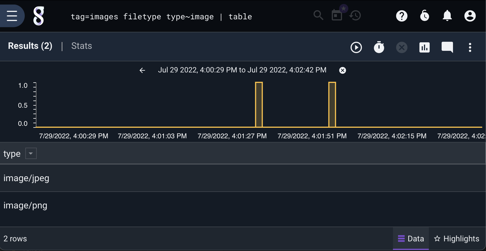

# Filetype

The `filetype` module is used to fingerprint a number of filetypes, and put that filetype into a named enumerated value. The underlying filetypes must be in their native format (such as an entry that is a raw JPEG). 

## Supported Options

* `-e`: Use an enumerated value instead of the DATA field.

## Usage

The `filetype` module requires that a single argument be provided which specifies the output enumerated value name to be populated with the MIME type value.  If the `filetype` module cannot identify a suitable MIME type for the given value the enumerated value will not be produced.

`filetype` allows for inline filtering using the standard string filter types.  Filters can cause entries to be dropped if a the filter explicitly forbids a value or if the filter requires a value but the MIME type cannot be resolved.

The supported filter operators are:

| Operator | Name |
|----------|------|
| == | Equal |
| != | Not equal |
| ~ | Subset |
| !~ | Not subset |


## Supported Types

### Images 

* jpg - image/jpeg
* png - image/png
* gif - image/gif
* webp - image/webp
* cr2 - image/x-canon-cr2
* tif - image/tiff
* bmp - image/bmp
* heif - image/heif
* jxr - image/vnd.ms-photo
* psd - image/vnd.adobe.photoshop
* ico - image/vnd.microsoft.icon
* dwg - image/vnd.dwg

### Video

* mp4 - video/mp4
* m4v - video/x-m4v
* mkv - video/x-matroska
* webm - video/webm
* mov - video/quicktime
* avi - video/x-msvideo
* wmv - video/x-ms-wmv
* mpg - video/mpeg
* flv - video/x-flv
* 3gp - video/3gpp

### Audio

* mid - audio/midi
* mp3 - audio/mpeg
* m4a - audio/mp4
* ogg - audio/ogg
* flac - audio/x-flac
* wav - audio/x-wav
* amr - audio/amr
* aac - audio/aac
* aiff - audio/x-aiff

### Archive

* epub - application/epub+zip
* zip - application/zip
* tar - application/x-tar
* rar - application/vnd.rar
* gz - application/gzip
* bz2 - application/x-bzip2
* 7z - application/x-7z-compressed
* xz - application/x-xz
* zstd - application/zstd
* pdf - application/pdf
* exe - application/vnd.microsoft.portable-executable
* swf - application/x-shockwave-flash
* rtf - application/rtf
* iso - application/x-iso9660-image
* eot - application/octet-stream
* ps - application/postscript
* sqlite - application/vnd.sqlite3
* nes - application/x-nintendo-nes-rom
* crx - application/x-google-chrome-extension
* cab - application/vnd.ms-cab-compressed
* deb - application/vnd.debian.binary-package
* ar - application/x-unix-archive
* Z - application/x-compress
* lz - application/x-lzip
* rpm - application/x-rpm
* elf - application/x-executable
* dcm - application/dicom

### Documents

* doc - application/msword
* docx - application/vnd.openxmlformats-officedocument.wordprocessingml.document
* xls - application/vnd.ms-excel
* xlsx - application/vnd.openxmlformats-officedocument.spreadsheetml.sheet
* ppt - application/vnd.ms-powerpoint
* pptx - application/vnd.openxmlformats-officedocument.presentationml.presentation

### Font

* woff - application/font-woff
* woff2 - application/font-woff
* ttf - application/font-sfnt
* otf - application/font-sfnt

### Application

* wasm - application/wasm
* dex - application/vnd.android.dex
* dey - application/vnd.android.dey

## Example

This example uses the `filetype` module to list the image types in the "images" tag. It additionally filters to display just images.

```gravwell
tag=images filetype type~image | table
```


