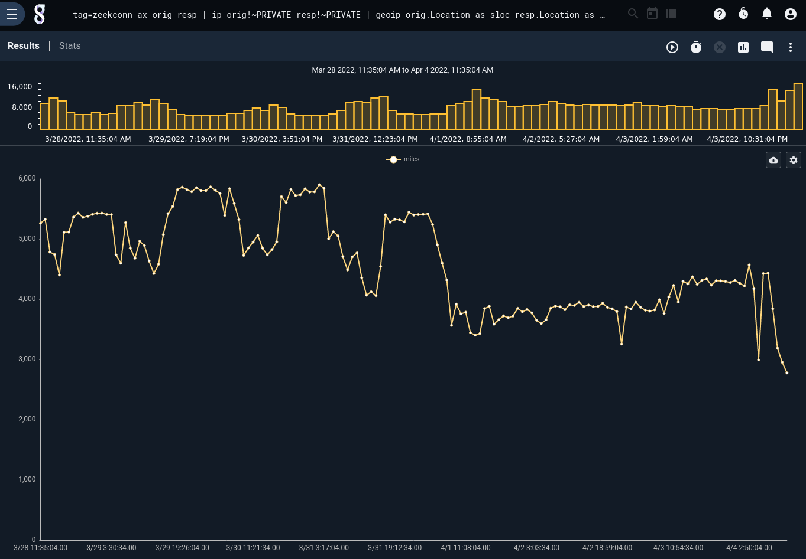

# Geodist module

The geodist module calculates the distance between two locations. By default, it gives its result in kilometers, but different units can be selected via the `-u` flag.

## Syntax

```
geodist [-u <unit>] (loc1 loc2 [as output])...
```

## Supported Options

* `-u <unit>`: select a different unit. Defaults to "km", but "mi" (miles), "m" (meters), and "nmi" (nautical miles) are also valid.

## Examples

This query charts the average distance, in miles, between source and destination in Zeek connection logs:

```gravwell
tag=zeekconn ax orig resp | ip orig!~PRIVATE resp!~PRIVATE | geoip orig.Location as sloc resp.Location as dloc | geodist -u mi sloc dloc as distance | stats mean(distance) as miles | chart miles
```


