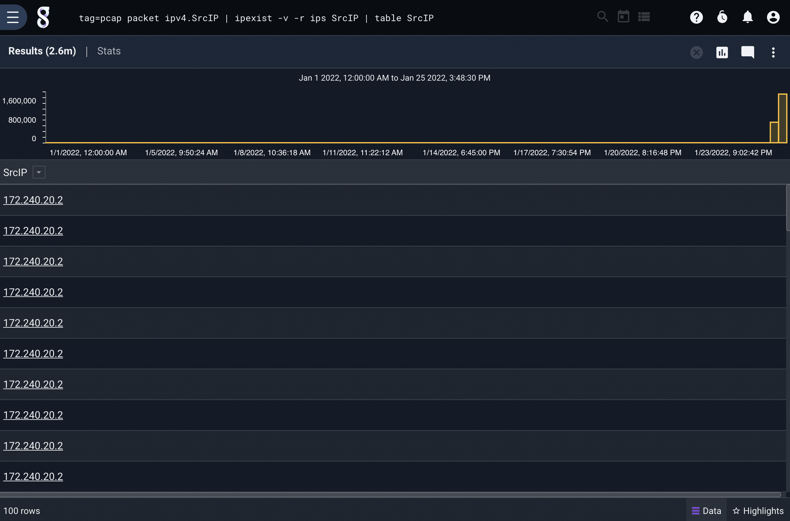

# IPexist

The ipexist module is designed to perform simple existence checks on IP addresses as fast as possible. It uses Gravwell's [ipexist library](https://github.com/gravwell/ipexist) to manage sets of IP addresses and quickly query the existence of a given IP within the set. Users specify one or more enumerated values to match against the set; by default, if all enumerated values match addresses within the set, the entry is passed.

```{note}
The ipexist module only operates on IPv4 addresses. All entries that attempt to match on an IPv6 address will be dropped.
```

## Supported Options

* `-r <resource>`: The "-r" flag specifies the name of a resource containing an ipexist-formatted lookup set. This flag may be specified multiple times to attempt lookups across multiple resources. See below for more information on creating these sets.
* `-v`: The "-v" flag tells the ipexist module to operate in an inverse mode. Thus, where the query `ipexist -r ips SrcIP` would normally pass through any entries whose SrcIP matches an ip in the resource, `ipexist -v -r ips SrcIP` would instead drop those entries and pass all others.
* `-or`: The "-or" flag specifies that the ipexist module should allow an entry to continue down the pipeline if ANY of the filters are successful.

## Creating IP sets

The ipexist module uses a specific format to store sets of IPv4 addresses that is designed to allow fast lookups while also remaining relatively space-efficient. This format is implemented in the [ipexist library](https://github.com/gravwell/ipexist), which includes a tool to generate the sets at the command line.

First, fetch the tool:

	go get github.com/gravwell/ipexist/textinput

Then populate a text file with the list of ip addresses you wish to have in the set, one IP per line. Ordering does not matter:

	10.0.0.2
	192.168.3.77
	10.3.2.1
	8.8.8.8

Then run the textinput tool, giving it the path to the input file and a path for the output:

	$GOPATH/bin/textinput -i /path/to/inputfile -o /path/to/outputfile

This should produce a properly-formatted output file which can be uploaded as a resource for use with the ipexist module.

## Example Usage

Assuming packets are captured under the `pcap` tag, the following query will only pass those packets whose source IP address matches an IP in the `ips` resource:

```gravwell
tag=pcap packet ipv4.SrcIP | ipexist -r ips SrcIP | table SrcIP
```


This query will pass any entry whose SrcIP **and** DstIP is found in the resource:

```gravwell
tag=pcap packet ipv4.SrcIP ipv4.DstIP | ipexist -r ips SrcIP DstIP | table SrcIP DstIP
```

Adding the `-or` flag makes the query more relaxed; it will pass any entry whose SrcIP **or** DstIP is found in the resource:

```gravwell
tag=pcap packet ipv4.SrcIP ipv4.DstIP | ipexist -or -r ips SrcIP DstIP | table SrcIP DstIP
```

## Inverting queries

The `-v` flag inverts the query: if you add `-v` to a query, any entry which would normally be dropped will be passed and vice versa.

This query *drops* those entries whose source IP addresses are found in the resource:

```gravwell
tag=pcap packet ipv4.SrcIP | ipexist -v -r ips SrcIP | table SrcIP
```



In the following query, any entry whose SrcIP **and** DstIP exist in the resource will be *dropped*. This query essentially says, "show me every packet whose source or destination is not in the known list".

```gravwell
tag=pcap packet ipv4.SrcIP ipv4.DstIP | ipexist -v -r ips SrcIP DstIP | table SrcIP DstIP
```

When combined with the `-or` flag, the module drops any entry where even one of the given enumerated values is found in the resource. In the example below, only those entries whose source IP **and** destination IP are *not* found in the resource will pass down the pipeline.

```gravwell
tag=pcap packet ipv4.SrcIP ipv4.DstIP | ipexist -or -r ips SrcIP DstIP | table SrcIP DstIP
```

### Multiple resources

Multiple unique IP sets may be specified by repeating the `-r` flag. The ipexists module will essentially treat them as one large set.

```gravwell
tag=pcap packet ipv4.SrcIP | ipexist -r ips -r externalips SrcIP | table SrcIP
```
