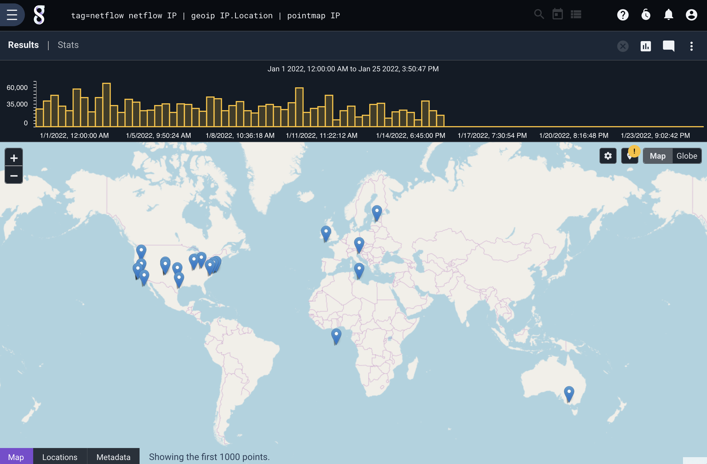
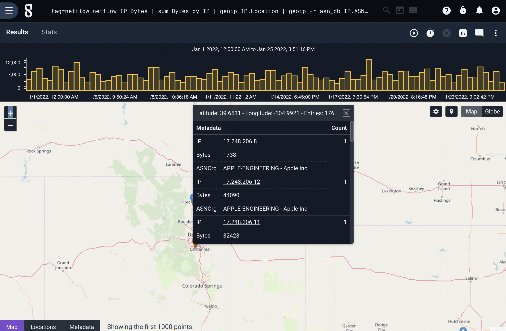
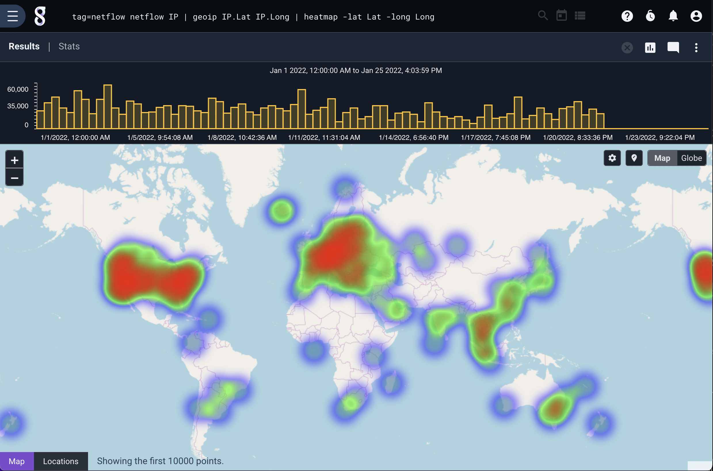
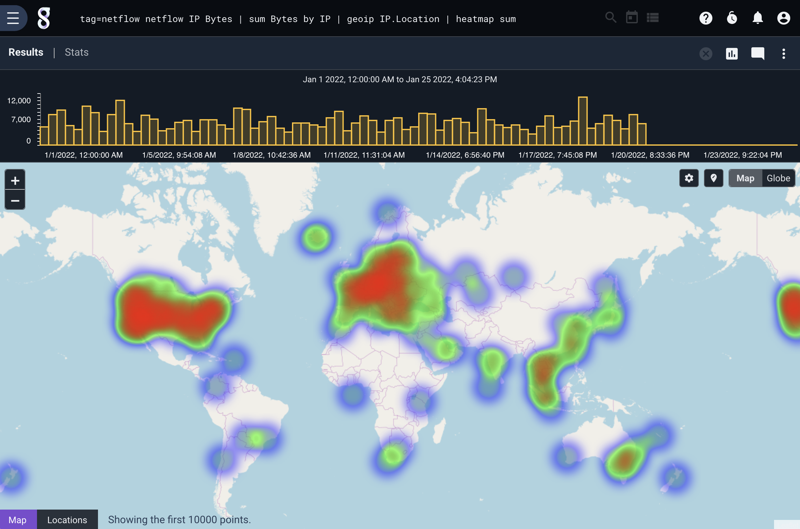

# Map modules

The `pointmap` and `heatmap` renderer modules translate search results onto a map. Both place entries on the map based on locations in enumerated values. By default, the modules look for an enumerated value called 'Location', as set by the [geoip](/search/geoip/geoip) search module. Locations can also be specified explicitly using the following:

* `-loc <enumerated value>` tells the module to look for a location in the specified enumerated value, rather than the default `Location`.
* `-lat <enumerated value> -long <enumerated value>` tells the module to look for the latitude and longitude values separately. These can be floating point numbers (as delivered by the `geoip` module) or strings from another source.

The map will display a maximum of 1000 points. It is geofenced, meaning that zooming in on one portion of the map will display up to 1000 points within that area.

# Pointmap

Pointmap translates entries into distinct markers on the map. If additional enumerated value names are specified, their contents will be displayed when a point is clicked.

The following search displays a map of all IP addresses captured in netflow records:

```gravwell
tag=netflow netflow IP | geoip IP.Location | pointmap IP
```



If we sum up the number of bytes from each IP and add the IP and Bytes enumerated values to pointmap's arguments, they will appear when we click on a point (we also added the ASN Organization so we can see WHO we are talking to):

```gravwell
tag=netflow netflow IP Bytes | sum Bytes by IP | geoip IP.Location | geoip -r maxmindASN IP.ASNOrg | pointmap IP Bytes ASNOrg
```



# Heatmap

Heatmap operates similarly to pointmap, but it takes 0 or 1 additional enumerated values as arguments. If no enumerated value argument is given, it generates a heat map using the number of entries for each location as the 'heat'. In this example using netflow records, the 'heat' represents the number of connections from a location:

```gravwell
tag=netflow netflow IP | geoip IP.Lat IP.Long | heatmap -lat Lat -long Long
```



If we add the total number of bytes as an argument, the 'heat' is derived from the number of bytes sent over the connection, rather than the number of connections:

```gravwell
tag=netflow netflow IP Bytes | sum Bytes by IP | geoip IP.Location | heatmap sum
```



## Getting in on that 3D

Heatmap and Pointmap also have 3D renderings, just click the "Globe" selector in the upper right hand side of the map and the map will redraw.


Running the exact same heatmap query, but rendered using the Globe system shows the following (The map rotates automatically so that all your bosses know you are definitely thinking in real-time about all the global threats):


