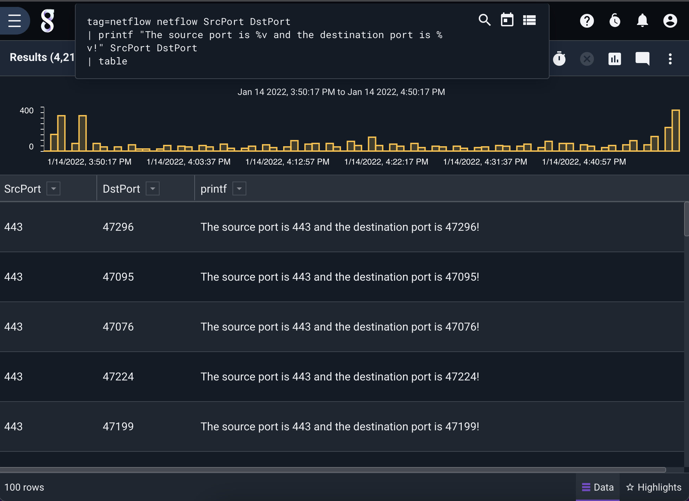

## Printf

The printf module implements a Go-style printf function, and supports a number of operator verbs. The module requires an formatting string, followed by the exact number of enumerated value arguments as required by the formatting string. 

The printf module implements the following verbs:

```
'%v': The value in a default format
'%s': string
'%b': base2
'%c': a character represented by a Unicode code point
'%d': base 10
'%o': base 8
'%O': base 8 with 0o prefix
'%q': a single-quoted character literal, escaped when necessary
'%x': base 16, with lower-case letters for a-f
'%X': base 16, with upper-case letters for A-F
'%U': Unicode format: U+1234; same as "U+%04X"
'%e': scientific notation, with lower-case e
'%E': scientific notation, with upper-case E
'%f': decimal point
'%F': synonym for %f
'%g': %e for large exponents, %f otherwise
'%G': %E for large exponents, %F otherwise
'%%': A literal %.
```

In addition, the following modifiers are available to many verbs: 

```
+	always print a sign for numeric values;
	guarantee ASCII-only output for %q (%+q)
-	pad with spaces on the right rather than the left (left-justify the field)
#	alternate format: add leading 0b for binary (%#b), 0 for octal (%#o),
	0x or 0X for hex (%#x or %#X); suppress 0x for %p (%#p);
	for %q, print a raw (backquoted) string if strconv.CanBackquote
	returns true;
	always print a decimal point for %e, %E, %f, %F, %g and %G;
	do not remove trailing zeros for %g and %G;
	write e.g. U+0078 'x' if the character is printable for %U (%#U).
' '	(space) leave a space for elided sign in numbers (% d);
	put spaces between bytes printing strings or slices in hex (% x, % X)
0	pad with leading zeros rather than spaces;
	for numbers, this moves the padding after the sign
```

### Supported Options

* `-e`: By default, printf creates an enumerated value "printf" to store the result in. Use `-e` to change the destination enumerated value.

### Example Usage

This example formats a simple string containing floating point numbers.

```gravwell
tag=netflow netflow SrcPort DstPort 
| printf "The source port is %v and the destination port is %v!" SrcPort DstPort 
| table
```



Note: Language describing the verbs and modifiers Copyright (c) 2009 The Go Authors. Obtained from [Go fmt documentation](https://pkg.go.dev/fmt#hdr-Printing)
