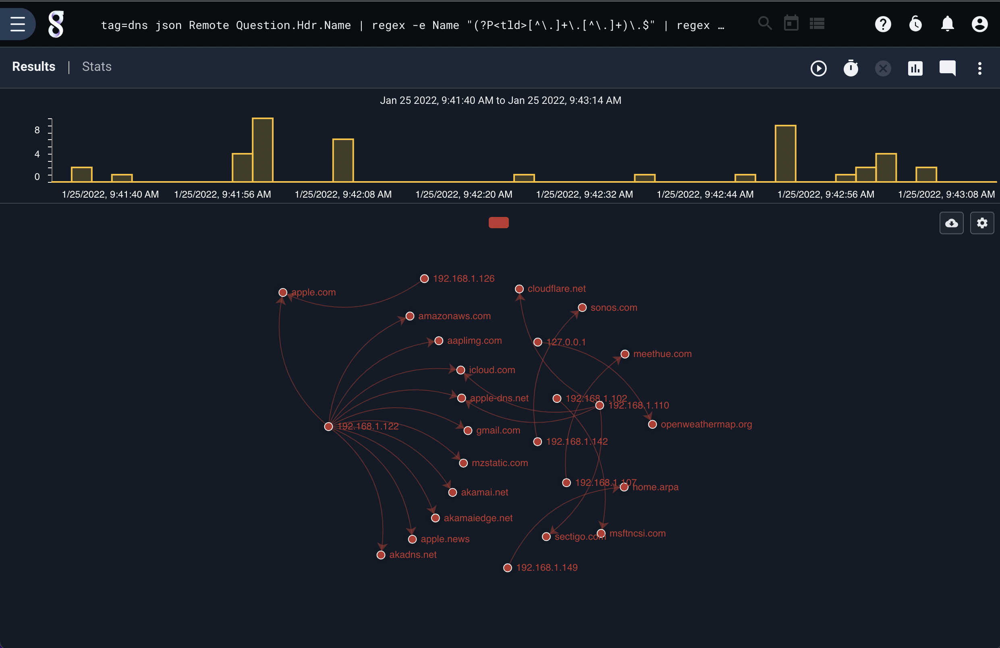
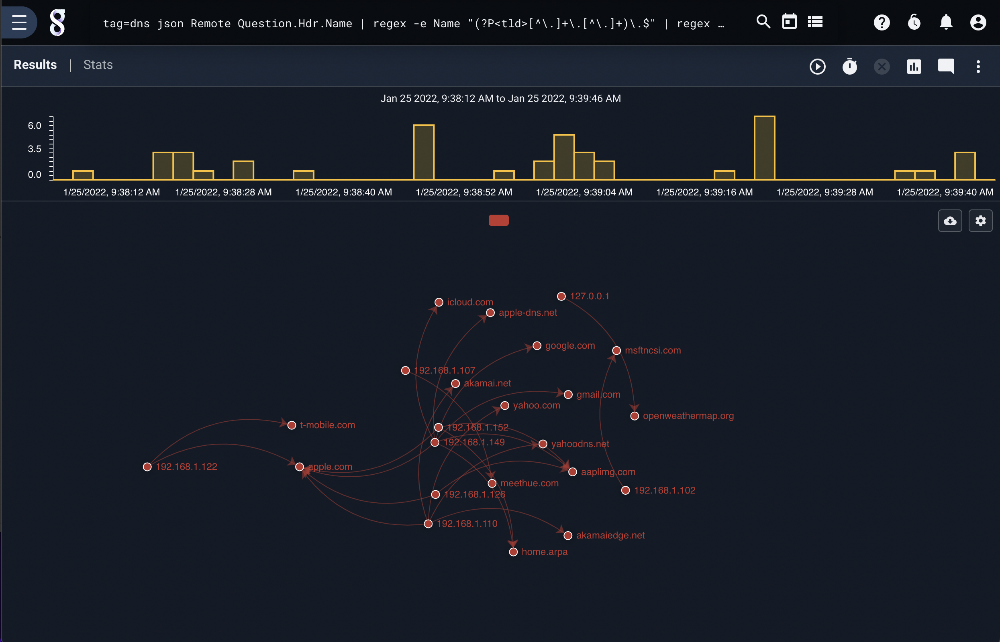

# Taint

The taint module is used for taint analysis and flow tracking.  The module can be used to specify known patient zero and then propagate "infections" forward.  Taint can also start from a known infection *endpoint* and work backwards in time to identify origination points.  To accomplish both tasks, the taint module has the ability to reverse the direction of the search system.  For example, if taint is attempting to start with a known patient zero, it will force the search to start at the beginning of the time window and move forward in time.  However, if taint is starting with a known infection and working backwards to find patient zero, it will force the search to start at the end of the time window and move backwards.

The process of taint tracking is designed to propagate marks forward or backwards in time.  For example if we knew A was tainted, and we saw A touch B, then B touched C, we would get a propagation of A->B->C whereby A, B, or C are all considered tainted and could then taint other enumerated values. The taint module can be used to track network flow propagation, infection propagation, or movement of physical systems.  For example, if we were tracking ICMP propagation, the source enumerated value might be "SrcIP" and the destination argument might be the enumerated value "DstIP".

Taint looks at enumerated values to track tainted values from source to destination.  The source and destination arguments to taint can be any named enumerated value.  When moving forward in time (starting with a patient zero, using the `-pz` flag) the taint module will look for the enumerated value specified by the source argument and extract its value.  If the source value has been marked as tainted (either via a patient zero argument, or because of previous tainting) the destination value is then also marked as tainted.

Taint tracking can also be performed in reverse, starting with some known infection point and working backwards in time using the `-f` flag.  The relationship of source to destination arguments is still preserved (source infects destination), so the source and destination enumerated value names should be reversed when using `-f` vs `-pz`, thus `taint -f <value> dst src` vs `taint -pz <value> src dst`.

Gravwell presented research at the S4x18 conference in Miami which successfully tracked USB based infectors that [hopped air gaps](https://s4x18.com/sessions/using-force-directed-graphs-to-analyze-huge-event-datasets/).

```{attention}
Because taint needs to control the direction of the search, it is not advisable to combine it with the sort module.
```

## Syntax

The command syntax for the taint module is similar to that of the [force directed graph renderer](/search/fdg/fdg), specifying source and destination enumerated values. As with the fdg renderer, we can also specify that infections are bidirectional (source->dest or dest->source) with the `-b` flag.  A starting point is required, specified as either a patient zero (-pz) or a known infection (-f).

## Supported Options
* `-pz <arg>`: The -pz flag specifies the value for a patient zero (starting point).  The module will look at the `<src>` EVs until it finds the value specified; it will then begin tracking infections from that source to the destinations.
* `-f <arg>`: The -f flag specifies the value for a known infection.  The module will look at the `<src>` EVs until it finds the value specified; it will then begin tracking infections *back* in time from that point.
* `-b`: The -b flag specifies that infections are bidirectional, and if either side has been tainted in the past, the taint is transferred to the other.
* `-a`: The -a flag specifies that the taint module will NOT drop entries that do not contain the source or destination enumerated values.

## How Taint Tracking Works

To illustrate how taint tracking works, we'll consider an example of human beings spreading the flu by shaking hands (an inherently "bidirectional" process). Suppose the following handshakes occur in a day:

```
08:00 Alice shakes hands with Bob
09:00 Bob shakes hands with Dan
10:00 Erin shakes hands with Bob
11:00 Frank shakes hands with Alice
12:00 Erin shakes hands with Gerard
```

If we know Dan is the "patient zero", we can work forward and see that at 09:00, Dan infects Bob. From this point, anyone who shakes with Dan *or* Bob is infected. At 10:00, Erin shakes with Bob, meaning she gets added to the infected list: [Dan, Bob, Erin]. At 11:00, Frank shakes hands with Alice, but since neither of them is on the infected list, we ignore this event. At 12:00, Erin shakes hands with Gerard, putting him on the infected list too: [Dan, Bob, Erin, Gerard]. Thus, by the end of the day, we know that Dan, Bob, Erin, and Gerard are infected, but Alice and Frank (probably) aren't.

Tracking backwards from a known infection works similarly, but with less certainty: if we know Erin is infected at the end of the day, we can work our way backwards and find that Gerard, Bob, Dan, *and Alice* are all potential "patient zeroes".

## Examples

If we were to assume that a new infection vector was found which could arbitrarily infect DNS servers by embedding a payload in their lookup cache, we could use the taint module to identify which top level domain names may have been attacked.  The following search starts with a known patient zero, and generates a force directed graph showing all future propagation of tainted domains in a small network.

```gravwell
tag=dns json Remote Answer.Hdr.Name |  regex -e Name "(?P<tld>[^\.]+\.[^\.]+)\.$" | regex -e Remote "(?P<ip>[\d\.]+):\d+" | taint -b -pz 192.168.1.122 ip tld | fdg -b ip tld
```



Reversing the work flow, the following search shows how a hunter might start with a known infection and work backwards to a potential patient zero:

```gravwell
tag=dns json Remote Answer.Hdr.Name |  regex -e Name "(?P<tld>[^\.]+\.[^\.]+)\.$" | regex -e Remote "(?P<ip>[\d\.]+):\d+" | taint -b -f apple.com tld ip | fdg -b ip tld
```


